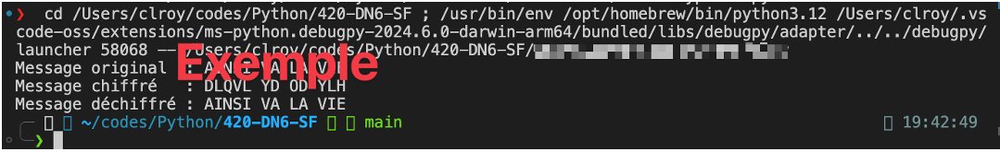
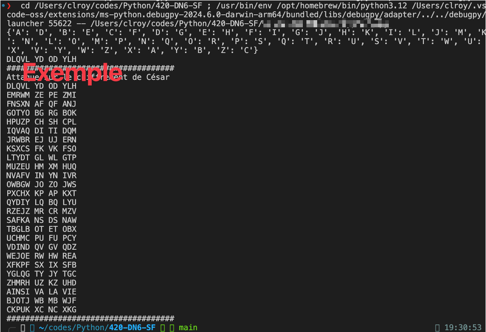
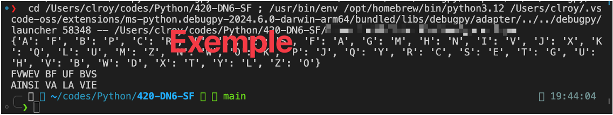
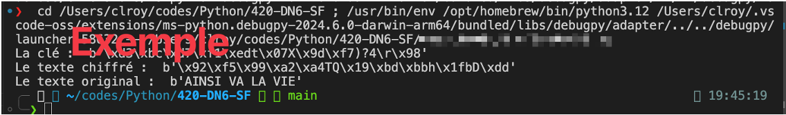
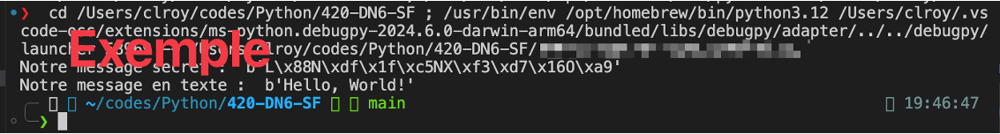
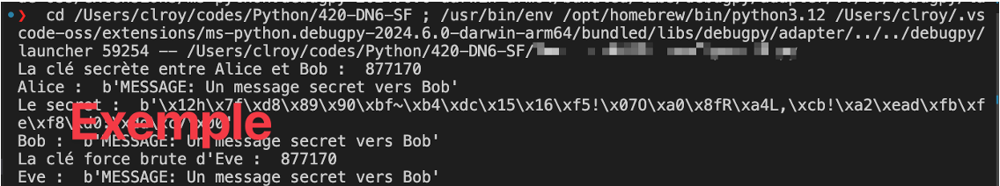
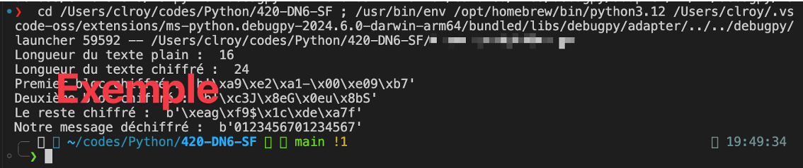
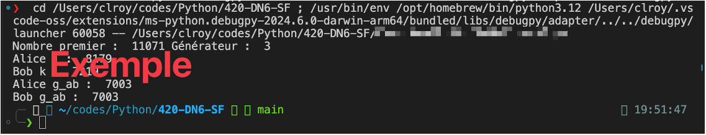
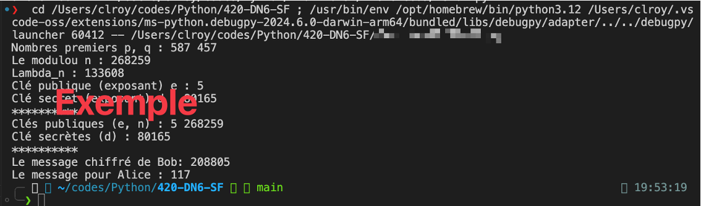
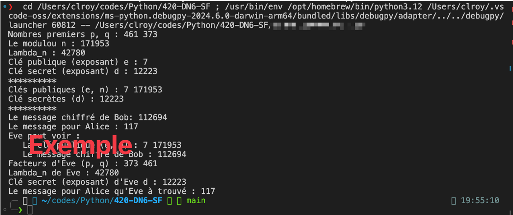

# Évaluation : éléments de la cryptographie et de la cryptanalyse  

## Informations  

**Évaluation** : 25 % de la session  
**Type de travail** : individuel  
**Date de remise** : voir sur léa  

## Les critères d’évaluation :

* Reconnais les mathématiques de la cryptographie.
* Reconnais des méthodes de cryptographies symétriques.
* Reconnais des méthodes de cryptographies asymétriques
* Applique quelques méthodes de cryptographie.
* Compare des méthodes de chiffrement des données (cryptographie).
* Reconnais des attaques cryptanalytiques.
* Applique quelques méthodes de cryptanalyse.

Dans ce travail, l’étudiant devra démontrer sa compréhension d'éléments de la cryptographie et créer un ou des programmes ou des systèmes qui démontrent différentes méthodes de chiffrements.

## Remise  

Sur GitHub :

  - Vous devez créer un dépôt privé pour cette évaluation.  
  - Votre dépôt se nommera Eval\_Crypto\_[Votre_nom].  
  - La visibilité est privée.
  - Le dépôt devra contenir :  
  	- Un fichier README.md qui résume les informations sur le dépôt.
  		- Nom du projet  
       - Date  
       - Votre nom  
       - Description du projet  
   - Tous les fichiers de votre travail, dont les codes sources demandés.  
   - Utiliser le document [Evaluation.md](Evaluation.md) pour y inclure les réponses aux questions et les captures d'écrans demandées.  
  - Vous devez m'ajouter à votre dépôt comme collaborateur (claude-roy).
  - Vous devez utiliser le format Markdown (md).
  - Vous devez donner vos sites de références.

Sur LÉA :

- Vous devez remettre l'adresse de votre dépôt GitHub dans un fichier texte (non compressé).

## Section 1 : Description

Durant les différents exercices, vous avez créé plusieurs scripts (programmes) en Python permettant de soit implémenter un algorithme de chiffrement ou d’en faire la cryptanalyse (casser).

Dans cette évaluation, vous allez démontrer votre compréhension de ce que vous avez réalisé ainsi que vos différentes solutions aux différents problèmes présentés dans les exercices.

**Note :** tous les scripts demandés doivent être en code Python.

### 1. Chiffrement de césar.

#### Question  

Vous devez expliquer le problème **majeur** de sécurité associé avec l'algorithme du chiffrement de César. Et, quel principe est démontré par ce problème ?

#### Programmation  

Vous devez inclure un script, nommé `CaesarCypher1.py`, qui démontre une implémentation du chiffrement de César. Le script doit avoir une fonction qui génère un flux de clés, une fonction qui chiffre et une qui déchiffre le message.

Vous devez également inclure un script, `CaesarCypher2.py`, qui démontre une attaque sur le chiffrement de César.

Inclure deux captures d’écrans démontrant l’exécution de chacun de vos scripts.

  
**Capture d’écran 1.**

  
**Capture d’écran 2.**

### 2. Chiffrement de substitution.  

#### Question  

Qu'est-ce qui n'est pas caché par le chiffrement par substitution ? Quel type d'attaque ça nous permet de faire ?

#### Programmation  

Vous devez inclure un script, nommé `SubstitutionCypher.py`, qui démontre une implémentation du chiffrement de substitution. Le script doit avoir une fonction qui génère un flux de clés, une fonction qui chiffre et une qui déchiffre le message.

Inclure une capture d’écran démontrant l’exécution de votre script.

  
**Capture d’écran 3.**

### 3. Chiffrement One Time Pad.

#### Question  

Pourquoi cet algorithme est-il considéré comme incassable ?

#### Programmation  

Vous devez inclure un script, nommé `OneTimePad.py`, qui démontre une implémentation du chiffrement One Time Pad. Le script doit avoir une fonction qui génère un flux de clés, une fonction XOR qui chiffre et déchiffre le message.

Inclure une capture d’écran démontrant l’exécution de votre script.

  
**Capture d’écran 4.**

### 4. Chiffrement de flux  

#### Question  

Quels compromis avons-nous dû faire par rapport au One Time Pad ?  

#### Programmation  

Vous devez inclure un script, nommé `StreamCipher1.py`, qui démontre une implémentation du chiffrement de flux. Le script doit avoir une classe qui génère un flux de clés, une fonction qui chiffre et déchiffre le message.

Inclure une capture d’écran démontrant l’exécution de votre script.

  
**Capture d’écran 5.**

Vous devez inclure un script, nommé `StreamCipher2.py`, qui démontre une attaque de texte connu sur l’implémentation du chiffrement de flux. Une attaque où Eve fait envoyée à Alice un message à Bob, un message qu’elle connait le contenu pour pouvoir se générer un flux de clé. Ce qui, par la suite, va lui permettre de déchiffrer une partie des autres messages envoyés entre Alice et Bob. Le script doit afficher le message d’Eve qu’Alice envoie à Bob, le message déchiffré de Bob, un deuxième message d’Alice à Bob et la partie qu’Eve a réussi à déchiffrer.

Inclure une capture d’écran démontrant l’exécution de votre script.

  
**Capture d’écran 6.**

### 5. Chiffrement par blocs.

#### Question  

Quel est le problème avec le mode ECB du chiffrement par bloc ?  

#### Programmation  

Vous devez inclure un script, nommé `DES.py`, qui démontre une implémentation du chiffrement DES avec le mode CBC. Le script doit afficher les blocs chiffrés de votre message ainsi que le message déchiffré.

Inclure une capture d’écran démontrant l’exécution de votre script.

  
**Capture d’écran 7.**  

### 6. La distribution de clés Diffie-Helleman.

#### Question  

Même s'ils n'en font pas mention dans leur article, quelle notion fut introduite par Diffie et Hellman avec leur schéma de distribution de clé ?

#### Programmation  

Vous devez inclure un script, nommé `DiffieHellman.py`, qui démontre une implémentation de l’échange de clé Diffie-Helleman. Le script doit avoir une fonction pour trouver des nombres premiers et une fonction pour trouver un générateur. Le script doit également afficher le nombre *j* d’Alice, le nombre *k* de Bob et les clés communes, *g\_ab*, générés par Alice et Bob.

Inclure une capture d’écran démontrant l’exécution de votre script.

  
**Capture d’écran 8.**  

### 7. RSA.

#### Question  

Donner deux raisons pourquoi on n'utilise pas, de manière générale, les algorithmes à clé publique pour chiffrer les messages.

#### Programmation  

Vous devez inclure un script, nommé `RSA1.py`, qui démontre une implémentation de RSA. Le script doit avoir une fonction pour trouver des nombres premiers et une fonction pour trouver un générateur. Dans le script, on doit retrouver les 5 étapes de RSA, ainsi qu’un message que Bob envoie chiffrer à Alice.

Inclure une capture d’écran démontrant l’exécution de votre script.

  
**Capture d’écran 9.**  

Vous devez inclure un script, nommé `RSA2.py`, qui démontre comment l’on peut casser RSA avec la factorisation des entiers. Le script doit afficher les valeurs *p*, *q*, *e*, *n* et *d* d’Alice, les valeurs *p* et *q* trouver par Eve, le *lambda\_n* trouver par Eve, la clé secrète *d* d’Alice trouvé par Eve, ainsi que le message déchiffré par Eve.

Inclure une capture d’écran démontrant l’exécution de votre script.

  
**Capture d’écran 10.**  

## Section 2 : Correction

| Item | Pondération\* | Résultat |
| :--- | :---: | :---: |
| **Partie 1** | 20 |  |
| **Partie 2** | 10 |  |
| **Partie 3** | 10 |  |
| **Partie 4** | 20 |  |
| **Partie 5** | 10 |  |
| **Partie 6** | 10 |  |
| **Partie 7** | 20 |  |
| **Total** | 100 |  |

\*Vous perdez 50 % de la note de la question pour un script qui s’exécute avec des erreurs. La question de la partir vaut pour 2 points.

## Compétences évaluées

**FW19 – Distinguer les éléments de la cryptographie et de la cryptanalyse.**  

	2 – Comparer les différentes méthodes actuelles de cryptographie.
	3 – Expliquer les éléments de la cryptanalyse.
