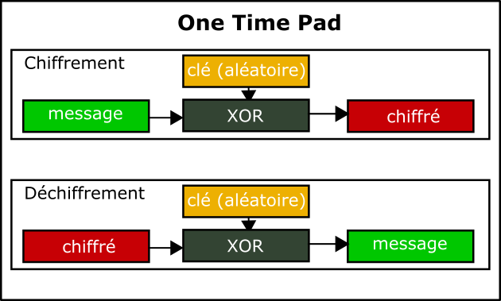
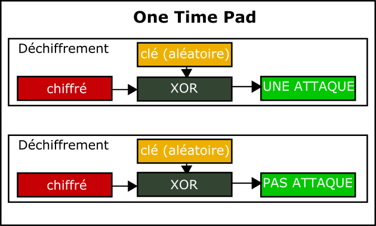

# Exercice 4 – One Time Pad

## Informations  

**Évaluation** : formative  
**Type de travail** : individuel  
**Durée** : 2 heures  
**Système d’exploitation** : Windows, Linux ou MAC  
**Environnement** : python  

## Objectifs

Cet exercice a pour objectifs :

*   Comprendre le fonctionnement de XOR.
*   Programmer un algorithme One Time Pad.
*   Vérifier son côté « incassable ».

Dans cet exercice, vous allez comprendre la fonction XOR en l’implémentant. Vous allez également implémenter le One Time Pad et vérifier qu’il est incassable.

### Partie 1 : Implémentation de XOR

Nous allons implémenter un exemple de la fonction XOR pour mieux la comprendre. La fonction XOR est importante pour comprendre l’algorithme One Time Pad.

**Note :** vous devez comprendre qu’il y a plusieurs solutions à un problème surtout en programmation, donc je vais vous présenter une de ces solutions.

#### Étape 1 : Exemple de XOR

1.  Créer un nouveau document appelé XOR.py. Implémenter une fonction xor(x, s) qui affiche un XOR entre deux nombres. L’opérateur python pour XOR est ^.

Utilisez les nombres de la théorie pour vérifier votre fonction :

```python
xor(4, 8)
xor(4, 4)
xor(255, 1)
xor(255, 128)
```

Votre résultat devrait ressembler à ça.

```bash
$ python3 XOR.py
4 xor 8 = 12
4 xor 4 = 0
255 xor 1 = 254
255 xor 128 = 127
``` 

La sortie est bonne, mais pas concluante pour comprendre que XOR est une fonction binaire.

2.  Utilisez la fonction <code>bin()</code> pour convertir vos nombres en binaire.

Par exemple, pour convertir le nombre de la variable x en binaire :

```python
bin(x)
``` 

Vous devez convertir vos paramètres ainsi que l’opération XOR dans votre fonction.

Votre résultat devrait maintenant ressembler à ceci.

```bash
❯ python3 XOR.py
0b100 xor 0b1000 = 0b1100
0b100 xor 0b100 = 0b0
0b11111111 xor 0b1 = 0b11111110
0b11111111 xor 0b10000000 = 0b1111111
```  

Le 0b devant le nombre indique que c’est un nombre binaire.  

### Partie 2 : Implémentation du One Time Pad

L’implémentation du One Pad Time en numérique se fait en utilisant la fonction XOR. On prend un texte en clair et l’on fait un XOR avec une valeur binaire aléatoire pour générer un fichier chiffré. Pour déchiffrer, on prend le message chiffré et l’on fait un XOR avec la même valeur binaire aléatoire.

   
**Figure 1 : One Time Pad**

#### Étape 1 : One Time Pad

1.  Pour débuter, nous avons besoin d’une clé aléatoire. Pour la démonstration, nous allons utiliser la librairie random (oui, secret serait mieux).

Nous voulons ensuite générer un texte chiffré en exécutant un XOR d’un message en texte clair avec notre clé aléatoire.

Finalement, on veut vérifier que nous pouvons récupérer le texte en clair en faisant un XOR du texte chiffré avec la même clé aléatoire.

Il nous faut une fonction pour générer la clé aléatoire.

```python
import random

def generate_key_stream(n):
	"""
	generate_key_stream(n)
	Génère une clé aléatoire pour le chiffrement
	
	Paramètres:
	n (int) : la longueur de la clé
	
	Return:
	Une clé aléatoire d'octets (valeur binaire)
	"""
	
	return bytes([random.randrange(0, 256) for i in range(n)])
```  

Il nous faut une fonction pour faire un XOR d’un texte avec la clé aléatoire.

```python
def xor_bytes(key_stream, texte):
	"""
	xor_bytes(key_stream, texte)
	Fait un XOR d'une clé aléatoire avec un texte
	
	Paramètres:
	key_stream (int) : clé aléatoire
	texte () : texte à faire un XOR
	
	Return:
	Texte chiffré ou déchiffré
	"""
	
	# Prends la longueur minimale entre les deux paramètres
	# La clé et le texte doivent être de la même longueur,
	# sinon on utilise le plus court des deux.
	length = min(len(key_stream), len(texte))
	# Le texte est traité octet par octet et retourne en octets
	return bytes([key_stream[i] ^ texte[i] for i in range(length)])
```  

Maintenant, on teste le tout. Il nous faut un message en texte clair.

```python
message = "AINSI VA LA VIE"
```  

Par contre, le message doit être binaire (voir les références pour la fonction encode).  

```python
message = message.encode()
```  

Il faut générer une clé aléatoire. La clé doit être la longueur du message (description du One Time Pad).

```python
key_stream = generate_key_stream(len(message))
```  

On génère le texte chiffré.

```python
secret = xor_bytes(key_stream, message)
```  

Pour retrouver le texte original, on refaire un XOR.

```python
plain_text = xor_bytes(key_stream, secret)
```  

Créez un document <code>OneTimePad.py</code> et implémentez le code précédent. N’oubliez pas des « print » pour afficher vos résultats.

Exécutez votre code.

Avez-vous réussi à chiffrer et déchiffrer votre texte ?  

### Partie 3 : La sécurité du One Time Pad

Les exigences du One Time Pad sont :

*   Le flux de clé est utilisé seulement une fois.
*   Le flux de clé est connu seulement de l’expéditeur et du destinataire.
*   Le flux de clé est vraiment aléatoire (pas de pseudo-aléatoire comme ici).

Pourquoi est-il si sécuritaire ?  

On se rappelle que chaque séquence de clés est également probable (rappelez-vous que les lettres clés sont générées de manière aléatoire), un adversaire n'a aucune information avec laquelle cryptanalyser le texte chiffré. Étant donné que chaque message en clair est également possible, il n'y a aucun moyen pour le cryptanalyste de déterminer quel message en clair est le bon. Une séquence de clés aléatoire ajoutée à un message en clair non aléatoire produit un message chiffré complètement aléatoire et aucune quantité de puissance de calcul ne peut changer cela.

Ce qui veut dire que si vous capturez un message ennemi chiffré et que vous demandez à des équipes de cryptanalystes de trouver le message. Une équipe peut essayer une clé aléatoire et arriver avec un message en clair plausible. Mais, une autre équipe peut essayer une autre clé aléatoire et arriver avec un autre message en clair plausible.

   
**Figure 2 : Deux équipes, deux messages**

Laquelle clé est la bonne ?  

Donc, avec un texte chiffré, si l’on ne connait pas la clé, on peut le déchiffrer à n’importe quel texte en clair de la même longueur que le message chiffré.  

#### Étape 1 : Vérifier notre affirmation

1.  Nous allons essayer de vérifier ce fait.

Nous allons utiliser les deux fonctions de la partie 1 : <code>generate\_key\_stream(n)</code> et <code>xor\_bytes(key\_stream, texte)</code>.

Créer un nouveau document <code>OneTimePad2.py</code> et lui insérer les fonctions de la partie 1 (n’oubliez pas d’importer la librairie random).

On insère la partie qui simule l’ennemi qui crée un message à envoyer.

```python
# Message de notre ennemi.
message = "UNE ATTAQUE"

# Le message doit être binaire.
message = message.encode()

# Générer une clé aléatoire. La clé doit être la longueur du message (description du One Time PAD).
key_stream = generate_key_stream(len(message))

#Génère le texte chiffré.
secret = xor_bytes(key_stream, message)
```  

Maintenant, on prend deux équipes qui essaient de casser le message.  

La première équipe :  

```python
# L'équipe 1 essaie avec le texte en clair PAS ATTAQUE
message = "PAS ATTAQUE"

# Le message doit être binaire.
message = message.encode()

# On essaie de générer une clé en utilisant le message chiffré
# et notre texte. Si la clé peut déchiffrer le message
# original, nous avons gagné. Vraiment ?
guess_key_stream = xor_bytes(message, secret)
print("La clé de chiffrement 1 : ", guess_key_stream)
plain_text = xor_bytes(guess_key_stream, secret)
print("Le texte original de l'équipe 1 : ", plain_text)
```  

```bash
$ python3 OneTimePad02.py
Le texte chiffré : b"\xa3\x9f'\xf4\xdc\x05^\x0b\xed\xd2\xc5"
La clé de chiffrement 1 : b'\xf3\xdet\xd4\x9dQ\nJ\xbc\x87\x80'
Le texte original de l'équipe 1 : b'PAS ATTAQUE'
```  

Selon la théorie de la cryptanalyse, si l’on trouve une clé qui nous donne un texte en clair cohérent, nous avons gagné. Donc, ça fonctionne avec la première équipe.   

La deuxième équipe essaie aussi (ajouter le code pour pouvoir comparer les clés) :  

```python
# L'équipe 2 essaie avec le texte en clair DES SURPRIS
message = "DES SURPRIS"

# Le message doit être binaire.
message = message.encode()

# On essaie de générer une clé en utilisant le message chiffré
# et notre texte. Si la clé peut déchiffrer le message
# original, nous avons gagné. Vraiment ?
guess_key_stream = xor_bytes(message, secret)
print("La clé de chiffrement 2 : ", guess_key_stream)
plain_text = xor_bytes(guess_key_stream, secret)
print("Le texte original de l'équipe 2 : ", plain_text)
```  

```bash
$ python3 OneTimePad02.py
Le texte chiffré : b'9\xabM\]-\x17N\xe9\x08Cn'
La clé de chiffrement 1 : b'i\xea\x1e}lC\x1a\xa8Y\x16+'
Le texte original de l'équipe 1 : b'PAS ATTAQUE'
La clé de chiffrement 2 : b'}\xee\x1e}~B\x1c\xb9Z\n='
Le texte original de l'équipe 2 : b'DES SURPRIS'
```  

On peut très bien voir que les deux équipes ont « réussis » avec des clés différentes.  

En connaissant la longueur du message, je peux générer la clé que je veux avec le texte que je veux.  

La base de la sécurité nous dit que si le message chiffré peut déchiffrer à n’importe quel texte clair, peu importe la puissance de calcul que vous avez, vous ne pourrez jamais savoir si vous avez la bonne clé.  

## Compétences développées

| FW19 – Distinguer les éléments de la cryptographie et de la cryptanalyse. | FW19 # 1 – Reconnaître les étapes historiques de la cryptographie.<br> FW19 # 2 – Comparer les différentes méthodes actuelles de cryptographie.<br> FW19 # 3 – Expliquer les éléments de la cryptanalyse. |
| :--- | :--- |

**Note** : les compétences sont développées en partie.

Références

[https://docs.python.org/3/library/random.html?highlight=random#module-random](https://docs.python.org/3/library/random.html?highlight=random#module-random)

[https://docs.python.org/3/howto/unicode.html](https://docs.python.org/3/howto/unicode.html)

[https://www.geeksforgeeks.org/python-operators/](https://www.geeksforgeeks.org/python-operators/)

[https://www.udemy.com/course/learn-modern-security-and-cryptography-by-coding-in-python/learn/lecture/21402408#search](https://www.udemy.com/course/learn-modern-security-and-cryptography-by-coding-in-python/learn/lecture/21402408#search)