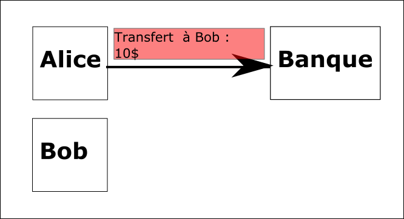
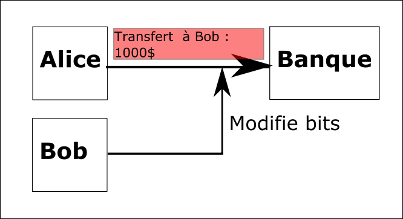
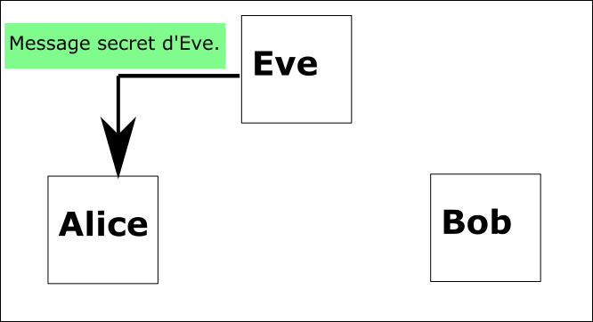
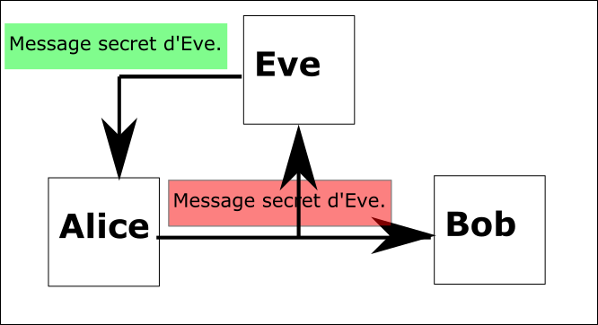
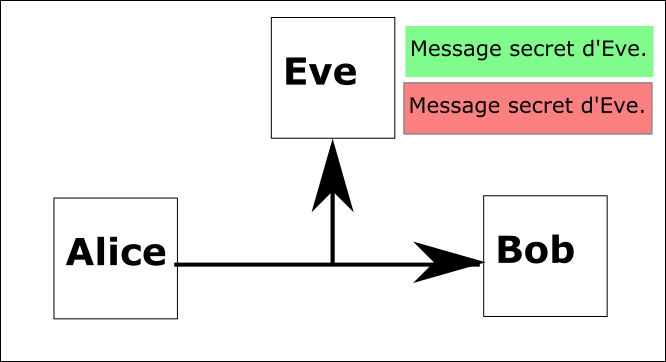
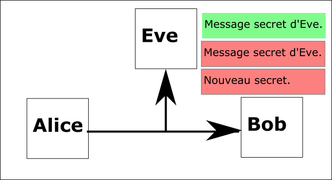
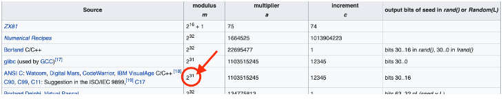

# Exercice 5 – Chiffrement de flux (Stream Ciphers)

## Informations

**Évaluation** : formative  
**Type de travail** : individuel  
**Durée** : 3 heures  
**Système d’exploitation** : Windows, Linux ou MAC  
**Environnement** : python  

## Objectifs

Cet exercice a pour objectifs :

* Programmer un algorithme de chiffrement de flux.
* Comprendre les avantages du chiffrement de flux.
* Comprendre quelques problèmes du chiffrement de flux.

Dans cet exercice, vous allez comprendre l’algorithme de chiffrement de flux en l’implémentant. Vous allez également comprendre les avantages de cet algorithme, mais quelques-uns de ces problèmes.

### Partie 1 : Implémentation du chiffrement de flux

Nous allons débuter par implémenter un algorithme de chiffrement de flux pour mieux le comprendre.

Nous devons trouver une manière de générer un flux de clé aléatoire. Cependant, on doit être capable de le régénérer du côté à la destination, il ne peut pas être complètement aléatoire. Le point commun entre la source et la destination est une clé pour le générateur de flux de clés.

La clé va lancer le système de clés aléatoires.

Nous allons utiliser un générateur congruentiel linéaire (LCG, Linear congruential generator) : <https://en.wikipedia.org/wiki/Linear_congruential_generator>. Nous avons donc une graine (seed) de départ qui permet de générer le prochain nombre qui va servir pour générer le prochain et ainsi de suite (relation de récurrence). L’équation est :

X<sub>n+1</sub> = (*a* X<sub>n</sub> + *c*) mod *m*

Le « mod *m* » est là pour limiter les nombres dans une certaine plage de nombres.

**Note :** vous devez comprendre qu’il y a plusieurs solutions à un problème surtout en programmation, donc je vais vous présenter une de ces solutions.

#### Étape 1 : Implémenter un LCG

1. Dans la page Wikipedia (<https://en.wikipedia.org/wiki/Linear_congruential_generator>), on ne trouve pas de fonction LCG dans Python, mais on peut voir qu’ANSI C en possède un avec les paramètres suivants :

*m* = 2<sup>31</sup>

*a* = 1103515245

*c* = 12345

On va se créer une classe pour générer notre flux de clés.

```python
class KeyStream:
	"""
	Classe KeyStream
	Classe pour générer un flux de clés
	"""
	def __init__(self, key=1):
		"""
		init (self, key=1)
		Initialise l'objet clé
		
		Paramètres:
		self : notre objet flux de clé
		key (int) : la clé partagée,
		elle est à 1 par défaut
		
		Return
		Notre objet KeyStream
		"""
		
		# Initialise l'objet à la clé
		self.next = key
	
	def rand(self):
		"""
		rand(self)
		Calcul la valeur aléatoire
		
		Paramètres:
		self : notre objet flux de clés

		Return:
		self.next (int) : la prochaine valeur aléatoire
		"""
		
		# L'équation pour notre LCG
		# Xnext+1 = (a*Xnext + c) mod m
		self.next = (1103515245 * self.next + 12345) % 2**31
		return self.next
		
	def get_key_byte(self):
		"""
		get_key_byte(self)
		Crée le flux de clé
		
		Paramètres:
		self : notre objet flux de clé
		
		Return:
		Retourne une clé aléatoire d’un caractère (le mod 256)
		"""
		
		return self.rand() % 256
```  

Créer un document `StreamCipher.py` avec le code précédent.

On va tester. Nous devons générer une séquence de nombres aléatoires de valeurs entre 0 et 255. Avec la même clé d’initialisation, on devrait toujours générer la même séquence. Cependant, une clé d’initialisation différente devrait générer une séquence différente.

Ajouter le code suivant à votre document. En ne mettant pas de valeur à notre objet clé de flux, la clé d’initialisation est 1.

```python
# Notre objet clé de flux
key = KeyStream()

# On génère une série de clés
# pour notre flux
for i in range(10):
	print(key.get_key_byte())
```  

Avez-vous 10 clés différentes ?

<details>
	<summary markdoen="span">Réponse :</summary>
	Oui.
</details>

Si vous exécutez le code à nouveau, avez-vous le même flux de clés ?

<details>
	<summary markdoen="span">Réponse :</summary>
	Oui.
</details>


Changez la clé d’initialisation et vérifiez que vous avez des valeurs différentes.

#### Étape 2 : Chiffrement et déchiffrement

1. Nous savons comment faire le chiffrement et le déchiffrement, car nous l’avons vu avec le One Time Pad : la fonction `xor_bytes`.

Nous devons, cependant, l’adapter un peu.

```python
def encryptDecrypt(key, message):
	"""
	encryptDecrypt(key, message)
	Chiffre le message
	
	Paramètres
	key (objet KeyStream): flux de clés
	message (bytes): message à chiffrer
	
	Return:
	(bytes) : message chiffré
	"""
	
	# On fait un XOR avec chacun des caractères du message
	# Une nouvelle clé est générée à chaque caractère
	return bytes([message[i] ^ key.get_key_byte() for i in range(len(message))])
```  

2. Maintenant, on teste notre implémentation.

```python
# On chiffre le message
# Notre objet clé de flux
key = KeyStream(23)

# Notre message à chiffrer
# Il doit être binaire
message = "Hello, World!".encode()
secret = encryptDecrypt(key, message)
print("Notre message secret : ", secret)

# On déchiffre le message
# On doit initialiser notre objet clé de flux de nouveau
# Notre clé seed est 23.
key = KeyStream(23)

# On déchiffre comme on chiffre avec un XOR
message = encryptDecrypt(key, secret)
print("Notre message en texte : ", message)
```  

Exécutez votre code.

Vous avez implémenté le chiffrement par flux. C’est comme le One Time Pad, mais les exigences pour le flux de clé ont beaucoup baissé.

Cette implémentation n’est pas sécuritaire (nous allons y revenir), et ça permet de voir qu’il est facile en cryptographie de commettre des erreurs.

### Partie 2 : Les bons et mauvais côtés de notre implémentation

Le chiffrement par flux n’a pas trop de problèmes de gérer les erreurs de transmission (flip de bit). Dans le chiffrement par bloc, un bit qui flip produit une erreur dans le bloc et le bloc est perdue, ce qui est plus dommageable. Avec le chiffrement par flux, si un bit flip, le message va quand même se rendre à la destination, on perd seulement ce bit.

Par contre, dans cette partie, nous allons également voir quelques problèmes que notre implémentation apporte.

#### Étape 1 : Gérer les erreurs de transmission

1. Nous allons simuler des problèmes de transmission et regarder comment réagit notre chiffrement par flux.

Débutons par se créer une fonction de transmission. Nous aurons besoin d’un certain hasard, donc importer random.

```python
def transmit(secret, tauxErreurs):
	"""
	transmit(secret, tauxErreurs)
	Fonction qui simule des erreurs de transmission.
	On passe le message octet par octet et de
	temps en temps on flip un bit selon le tauxErreur passé.
	
	Paramètres :
	secret (bytes) : le message qui est transmis
	tauxErreurs () : le niveau d'erreur qu'on veut insérer dans le message
	
	Return :
	(bytes) : le message avec des erreurs
	"""
	
	# Contiens le message modifié
	b = []
	
	# On passe chaque octet du message et
	# l'ajoute à b
	for c in secret:
		# Selon notre taux d'erreur, on
		# flip un bit dans l'octet
		if random.randrange(0, tauxErreurs) == 0:
			#
			c = c ^ 2**random.randrange(0, 8)
			b.append(c)
	return bytes(b)
```  

Nous allons afficher le message original et générer les erreurs. Nous allons également envoyer un message plus long (pour mieux comprendre comment le message de destination est affecté). Modifiez votre code comme suit.

```python
# On chiffre le message
# Notre objet clé de flux
key = KeyStream(23)

# Notre message à chiffrer
# Il doit être binaire
message = "Nous allons attaquer a 12 h, par le cote Est de la prairie".encode()
secret = encryptDecrypt(key, message)

###### Partie de codes à ajouter #####
# On veut voir le message original
print("Notre message est : ", message)
# On génère les erreurs tous les 6 octets
secret = transmit(secret, 6)
#######################################

# On déchiffre le message
# On doit initialiser notre objet clé de flux de nouveau
# Notre clé seed
key = KeyStream(23)

# On déchiffre comme on chiffre avec un XOR
message = encryptDecrypt(key, secret)
print("Notre message en texte : ", message)
```  

Exécutez votre code quelques fois.

Pouvez-vous lire le message de destination ?

<details>
	<summary markdoen="span">Réponse :</summary>
	Oui, même s’il comporte des erreurs.
</details>

Le message est un peu difficile à lire, mais c’est possible. Nous n’avons pas perdu tout le contenu. Si nous avions une transmission de la parole (message radio chiffré), on entendrait des clics, mais la destination aurait quand même le message.

#### Étape 2 : Problème d’authentification

Le chiffrement par flux peut gérer quelques erreurs de transmission. Le message de destination n’est pas exact, mais compréhensible. Pour une transmission vocale, ça ne cause pas trop de problèmes. Mais, quand est-il si l’on veut que le message transmis soit exact à la destination, qu’il ne puisse pas être modifié en chemin ?

On parle ici d’un problème d’authentification.

Prenons comme exemple Bob qui effectue un travail pour Alice et demande une rémunération pour son travail. Alice est d’accord pour le rémunérer, mais le paie 10 $ et envoie un message chiffré à sa banque pour le transfert.

  
**Figure 1 : Alice envoie un message à sa banque.**   

Cependant, Bob n’est pas satisfait de la rémunération et il sait que le chiffrement par flux est utilisé. Il intercepte le message avant qu’il n’arrive à la banque et il modifie des bits.


**Figure 2 : Bob intercepte le message.**  

C’est possible, car la source n’est pas authentifiée.

On essaie ce scénario maintenant

1. On va modifier la partie principale de notre code pour l’adapter à notre scénario.

```python
# Alice envoie son message à la banque
# Les deux se sont accordé pour la clé 10
key = KeyStream(10)

# Notre message à chiffrer
message = "Transfert a Bob : 10$".encode()
print("Alice : ", message)
secret = encryptDecrypt(key, message)
print("Le secret : ", secret)

# Bob intercepte le message ici


# La banque reçoit le message
# La banque connait la clé d'Alice
key = KeyStream(10)
message = encryptDecrypt(key, secret)
print("La banque : ", message)
```  

Essayez votre code.

La banque reçoit-elle le message d’Alice ?  

<details>
	<summary markdoen="span">Réponse :</summary>
	Oui.
</details>


2. Bob connaît le formatage du message pour demander un transfert à la banque et il connaît l’algorithme de chiffrement, le chiffrement par flux.

Il doit intercepter le message et modifier les octets qui touchent le montant du transfert.

Nous allons nous créer une fonction modification.

```python
def modification(secret):
	"""
	modification(secret)
	Fonction qui modifie certains octets du message,
	sans la clé
	Nous allons flipper des bits, mais pas
	n'importe quels bits, ceux en notre faveur
	
	Paramètres :
	secret (bytes) : le message secret

	Return :
	(bytes) : le message secret modifié
	"""
	
	# On créer une liste de zéro de la même
	# longueur que le secret
	mod = [0] * len(secret)
	
	# On fait la même opération que pour chiffrer
	return bytes([mod[i] ^ secret[i] for i in range(len(secret))])
``` 

Pour l’instant, la fonction ne change rien. On veut voir si l’on peut modifier le message secret, mais sans en altérer l’information.

Appeler la fonction sous le commentaire Bob intercepte le message. Le retour affecte secret (on veut le changer).

```python
# Ajouter votre code.
``` 

Essayez votre code, le message devrait rester le même. Sinon, dépanner.

```bash
$ python3 StreamCipher05.py
Alice : b'Transfert a Bob : 10$'
Le secret : b'/\xea\x90\xb8$"H\x10\x87\x90H\x8e\r\xb3\x87\x9aQ\xe8A\xa6vD\xb9'
La banque : b'Transfert a Bob : 10$'
```  
Parfait! Nous pouvons manipuler le message sans connaître la clé.

3. On veut modifier certains octets, mais pas n’importe lequel. On veut modifier les octets qui touchent au montant à transférer.

En comptant les caractères (octets) du message, on doit changer les caractères 18 à 20 (le premier caractère est 0).

```bash
Transfert a Bob : __10$
Transfert a Bob : 1000$
```  

Le caractère 18 à un espace que l’on doit changer pour un 1, le caractère 19 a un espace que l’on doit changer pour un 0 et le caractère 20 a un 1 que l’on doit changer pour un 0.

Par exemple, pour modifier le caractère 19 :

```python
mod[19] = ord(' ') ^ ord('1')
``` 

**Note :** voir la section références pour une description de la fonction `ord()`.

Ajouter avant le `return` de la fonction `modification`, le code pour changer les caractères 18 à 20.

```python
# Ajouter votre code.
```   

Exécutez votre code.

Est-ce que Bob reçoit le montant désiré ?

<details>
	<summary markdoen="span">Réponse :</summary>
	Oui.
</details>

Dans cette situation, la banque ignore que ce n’est pas le message original. Il n’y a aucun moyen d’authentifier la source.

Une solution à ce problème serait d’instaurer un code MAC (Message Authentication Code).

### Étape 3 : une autre faiblesse, réutilisation de la clé

Une fois que nous avons déterminé une clé avec la destination, on va réutiliser cette clé pour plusieurs messages (sinon, pour tous les messages avec la même destination). C’est une autre faiblesse de notre chiffrement.

Prenons le scénario suivant, Alice communique avec Bob et ils ont déterminé une clé commune. Eve communique avec Alice et lui fait part d’un message hyper important.

  
**Figure 3 : message d'Eve.**  

Comme Bob est le meilleur ami d’Alice, Alice lui fait parvenir le message. Eve s’est préparée et elle intercepte le message envoyé à Bob.

  
**Figure 4 : Eve intercepte.**  

Maintenant, Eve a le message en texte clair et le message chiffré.

  
**Figure 5 : Eve possède le texte clair et le message chiffré.**  

Elle peut également intercepter les autres messages envoyés entre Alice et Bob.

  
**Figure 6 : Eve intercepte les messages.**  

Que peut-elle faire avec ça ?

1. On prépare notre code pour notre scénario. Modifiez la partie principale comme suit :

```python
# Eve donne un message à Alice
message_Eve = "Ceci est un message super hyper important".encode()

# Alice communique avec Bob
# Les deux se sont accordé pour la clé 33
key = KeyStream(33)
message = message_Eve
print("Alice : ", message)
secret = encryptDecrypt(key, message)
print("Le secret : ", secret)

# Voilà Bob
key = KeyStream(33)
message = encryptDecrypt(key, secret)
print("Bob : ", message)
``` 

Le reste de notre code ne change pas pour l’instant (on peut ignorer les fonctions modification et transmit)

Exécutez votre code et assurez-vous que Bob déchiffre bien le message d’Alice (en réalité d’Eve).

2. Maintenant, la vilaine Eve va intercepter le message. Eve se place entre Alice et Bob. Elle intercepte le secret, mais elle possède le message en texte clair.

Eve veut se générer un flux de clé à partir de son message. Nous allons créer une fonction qui fait la même chose que l’on fait depuis le début : un XOR octets par octets.

```python
def get_key(message, secret):
	"""
	get_key(message, secret)
	Génère un flux de clés à partir d'un message en texte clair
	et d'un message chiffré
	
	Paramètres :
	message (bytes) : message en clair
	secret (bytes) : message chiffré
	
	Return :
	(bytes) : flux de clés
	"""
	
	# Fait un XOR octet par octet
	return bytes([message[i] ^ secret[i] for i in range(len(secret))])
``` 

Ajoutez le code ci-dessus à votre document.

Ajoutez le code pour appeler la fonction. Le code doit se placer entre Alice et Bob et permettre d’instancier une variable `eves_key_stream`.

```python
# Ajouter votre code.
```
Exécutez votre code pour vérifier qu’il n’y a pas d’erreur.

C’est normal que la sortie ne soit pas différente, Eve a seulement créé un flux de clé.

3. Nous sommes dans la deuxième partie du scénario : Alice envoie un nouveau message à Bob.

Ajoutez le code à la fin de votre document pour qu’Alice envoie le nouveau message « Salut Bob, nous allons dominer le monde et la galaxie » à Bob et que Bob le déchiffre.

N’oubliez pas qu’Alice doit :

* générez le flux de clés;
* encodez le message;
* chiffrez le message.

Bob doit :

* générez le flux de clés;
* déchiffrez le message.

```python
# Ajouter votre code.
```  

Dans notre scénario, Eve intercepte également ce message et Eve a un flux de clé.   Peut-elle déchiffrer le message avec son flux de clés ?

Elle ne peut pas utiliser la fonction de déchiffrement, car elle n’a pas la clé (on pourrait essayer de trouver la clé, mais on va utiliser quelque chose de plus rapide).

On va se créer une fonction qui utilise le flux de clé généré. Naturellement, on ne peut pas déchiffrer plus que la longueur de la clé ou la longueur du message. Il faut donc trouver le minimum entre les deux.

Ajoutez la fonction `crack` à votre code, ainsi que l’appel de la fonction à la fin de votre code.

```python
def crack(key_stream, secret):
	"""
	crack(key_stream, secret)
	Fonction qui utilise un flux de clés pour déchiffrer
	le message chiffré.
	
	Paramètres :
	key_stream (bytes) : le flux de clés
	secret (bytes) : le message chiffré
	
	Return :
	
	"""
	
	# On ne peut déchiffrer plus que la longueur
	# du flux de clés ou de la longueur du
	# message. On recherche le plus petit
	length = min(len(key_stream), len(secret))
	
	# On refait toujours la même chose :)
	return bytes([key_stream[i] ^ secret[i] for i in range(length)])

# Ajouter à la fin du document
# Encore Eve qui capture notre message secret
print("Eve crack : ", crack(eves_key_stream, secret))
```  

Exécutez votre code.

Eve, a-t-elle réussi à déchiffrer une partie du message ?

<details>
	<summary markdoen="span">Réponse :</summary>
	Oui.
</details>  

En réutilisant une clé, on peut voir que si nous sommes trompés à utiliser un message d’un ennemi, l’ennemi peut extraire un flux de clés.

### Étape 4 : Faible entropie

Le chiffrement de flux possède une faible entropie.

En cryptographie, l'entropie fait référence au caractère aléatoire collecté par un système pour être utilisé dans des algorithmes nécessitant des données aléatoires. Un manque de bonne entropie peut rendre un cryptosystème vulnérable et incapable de chiffrer les données en toute sécurité.[[1]](#footnote-2)

Donc, sans entropie, pas de sécurité.

On génère nos données aléatoires d’une fonction `rand` (pour random) qui utilise LCG. Comment aléatoire est LCG ? Si l’on retourne à notre page Wikipédia, elle semble être de 31 bits.

  
**Figure 7 : entropie.**  

Donc, essayons de faire une attaque sur notre sécurité à 31 bits.

1. Nous allons essayer de faire une attaque brute force.

On sait que lorsqu’un programmeur crée un programme, il peut faire de petites erreurs ;).

Si l’on regarde notre méthode `rand`, il semble que notre implémentation de LCG est bien de 31 bits.

```python
def rand(self):
	# L'équation pour notre LCG
	# Xnext+1 = (a*Xnext + c) mod m

### Par le 2**31
	self.next = (1103515245 * self.next + 12345) % 2**31
	return self.next
```  

Même si l’on utilise à la méthode d’initialisation (`__init__`) de l’objet une clé initiale de plus de 31 bits, la méthode `rand`, par son modulo, va ramener le tout à 31 bits.

Nous allons préparer notre partie principale de code. Le code de votre partie principale devrait ressembler à ceci :

```python
# Alice communique Avec Bob
cle_secret = 33
print("La clé secrète entre Alice et Bob : ", cle_secret)
key = KeyStream(cle_secret)
message = "MESSAGE: " + "Un message secret vers Bob"
message = message.encode()
print("Alice : ", message)
secret = encryptDecrypt(key, message)
print("Le secret : ", secret)

# Voilà Bob
key = KeyStream(cle_secret)
message = encryptDecrypt(key, secret)
print("Bob : ", message)

# Encore Eve qui veut notre message secret
``` 

Exécutez votre code pour s’assurer que tout fonctionne. Sinon, on dépanne.

2. Eve veut trouver la clé avec une attaque de force brute (brute-force).

Eve peut intercepter le message chiffré et trouver une clé, mais comment sait-elle que le message en clair, qu’elle aura trouvé, est le bon message ?

Vous avez remarqué que j’ai ajouté une partie MESSAGE: au texte d’Alice. Cette partie est l’entête du message. Lorsqu’on chiffre un message, normalement la transmission a une structure que nous connaissons. Ceci est un scénario réaliste, à la base tout ce que l’on chiffre à une structure de transmission et comme cryptanalyste vous devez connaître la structure du document que vous déchiffrez. Sinon, vous n’aurez aucun moyen de savoir si le message est bien déchiffré et vous devrez avoir recours à des méthodes d’analyse très avancées pour savoir si vous êtes dans le bon chemin.

Changeons le message d’Alice pour le rendre plus général. Le message :  

```python
message = "MESSAGE: " + "Un message secret vers Bob"
```  
Il devient :

```python
header = "MESSAGE: "
message = header + "Un message secret vers Bob"
```  

Maintenant, Eve a besoin d’une fonction pour brute forcer la clé utiliser par Alice et Bob.

```python
	def brute_force(plain, secret):
	"""
	brute_force(plain, cipher)
	Fonction qui trouve une clé secrète par force brute.
	
	Paramètres :
	plain (bytes) : Une partie de texte en clair connu.
	secret (bytes) : le texte chiffré.
	
	Return
	(bytes) : la clé secrète commune
	"""
	
	# On veut faire une attaque force brute.
	# On doit essayer toutes les clés possibles.
	for key in range(2**31):
		# On se crée un flux de clés possible
		bf_key = KeyStream(key)
		
		# On vérifie si le texte connut XOR avec le texte chiffré
		# retourne une clé secrète égale à notre clé.
		# Sinon, on sort et essaie un autre flux de clé.
		# Si oui, on retourne la clé.
		# Au premier caractère qui ne fonctionne pas, on sort.
		# On vérifie tout le texte clair, même si
		# une clé fonctionne. Au cas où un octet serait bon
		# mais pas le suivant, donc mauvaise clé.
		for i in range(len(plain)):
			xor_value = plain[i] ^ secret[i]
			if xor_value != bf_key.get_key_byte():
				break
			else:
				return key
		
	# Si toutes les clés ne fonctionnent pas, Bummer!
	return False
```  

Sous le commentaire d’Eve, ajoutez le code pour appeler la fonction. Le texte connu est l’entête. De plus, nous allons imprimer la clé, essayer de déchiffrer le message avec la clé d’Eve et afficher le message déchiffré d’Eve.  

```python
# Encore Eve qui veut notre message secret
bf_key = brute_force(header.encode(), secret)
print("La clé force brute d'Eve : ", bf_key)
key = KeyStream(bf_key)
message = encryptDecrypt(key, secret)
print("Eve : ", message)
```  
Exécutez votre code.

Avez-vous la clé et le bon message ?

<details>
<summary markdown="span">Réponse :</summary>  
Oui.  

```bash
$ python3 StreamCipher.py
La clé secrète entre Alice et Bob :  33
Alice :  b'MESSAGE: Un message secret vers Bob'
Le secret :  b'\x0bBg\x0e\x93\xe4\xe5c>\xaa\xa25G~\xcb\xe2\x97\x90\x01\xed\xf1\xf6\xb3\xbb\xab\x9b\xdc\xf3\xbfy\x9b!\xe4\x88\xf6'
Bob :  b'MESSAGE: Un message secret vers Bob'
La clé force brute d'Eve :  33
Eve :  b'MESSAGE: Un message secret vers Bob'
```  
</details>  

3. On peut voir qu’Eve a réussi a trouvé la clé, mais notre clé est petite, 33. Quand est-il d’une clé plus grosse ?

Nous allons générer une clé pour Alice et Bob aléatoire et un peu plus grosse que 33.

Changez l’affectation de la clé pour générer une clé aléatoire jusqu’à 20 bits :

```python
cle_secret = random.randrange(0, 2**20)
```  

Exécutez votre code.

Avez-vous la clé et le message original ?

<details>
<summary markdown="span">Réponse :</summary>  
On a le message original, mais la clé ne semble pas la bonne.  

```bash
$ python3 StreamCipher11.py
La clé secrète entre Alice et Bob :  196988
Alice :  b'MESSAGE: Un message secret vers Bob'
Le secret :  b'H\x1f\xd8;\xc0a".\x9d\xe7m\xa0\xd4\x9b,\xdf\x14m\x1e\xb8\x82\xb346H\x16\xd3\xc6L\xdc<\xfc\xa7\xd5\t'
Bob :  b'MESSAGE: Un message secret vers Bob'
La clé force brute d'Eve :  124
Eve :  b'MESSAGE: Un message secret vers Bob'
```  
</details>  


Pourquoi la clé d’Eve ne semble pas la bonne, mais le message est quand même déchiffré ? (La réponse se trouve dans la méthode `get_key_byte(self)`.)

4. On a fait l’erreur du modulo sur le nombre retourné, donc on agit sur la partie la moins significative du nombre et c’est comme le tronquer à 8 bits (256). Nous aurions dû agir sur la partie la plus significative du nombre pour garder la longueur totale de la clé.

Avant de faire le modulo, nous allons faire un déplacement (shift) à droite du nombre retourné pour se placer dans la partie la plus significative.

Changez le return de la méthode `get_key_byte` comme suit :  

```python
return (self.rand()//2**23) % 256
```  

**Note :** nous aurions également pu utiliser l’opérateur shift droite : (self.rand() >> 23).

Exécutez votre code.

La clé a-t-elle gardé sa longueur ?

<details>
<summary markdown="span">Réponse :</summary>  
Oui.
</details>  

Eve peut-elle toujours trouver notre clé ?

<details>
<summary markdown="span">Réponse :</summary>  
Malheureusement, oui.  
</details>  

On voit ici qu’une erreur très simple peut abaisser de beaucoup la sécurité de nos communications. C’est pour cette raison qu’il n’est jamais une bonne idée de coder notre propre algorithme de chiffrement, mais plutôt d’utiliser des algorithmes et des librairies déjà testés et validés par la communauté.

Compétences développées

| **FW19** – Distinguer les éléments de la cryptographie et de la cryptanalyse. | **FW19 # 1** – Reconnaître les étapes historiques de la cryptographie.<br>**FW19 # 2** – Comparer les différentes méthodes actuelles de cryptographie.<br>**FW19 # 3** – Expliquer les éléments de la cryptanalyse. |
| :--- | :--- |

**Note** : les compétences sont développées en partie.

Références

<https://en.wikipedia.org/wiki/Linear_congruential_generator>

<https://docs.python.org/3/library/functions.html?highlight=ord#ord>

<https://docs.python.org/3/library/random.html?highlight=random#module-random>

<https://docs.python.org/3/howto/unicode.html>

<https://www.geeksforgeeks.org/python-operators/>

##

1. [https://en.wikipedia.org/wiki/Entropy_(computing)](https://en.wikipedia.org/wiki/Entropy_%28computing%29) [↑](#footnote-ref-2)