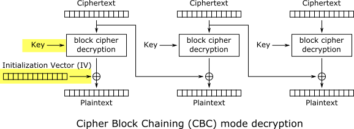
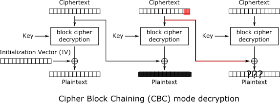
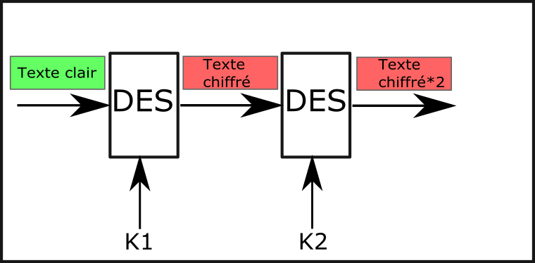
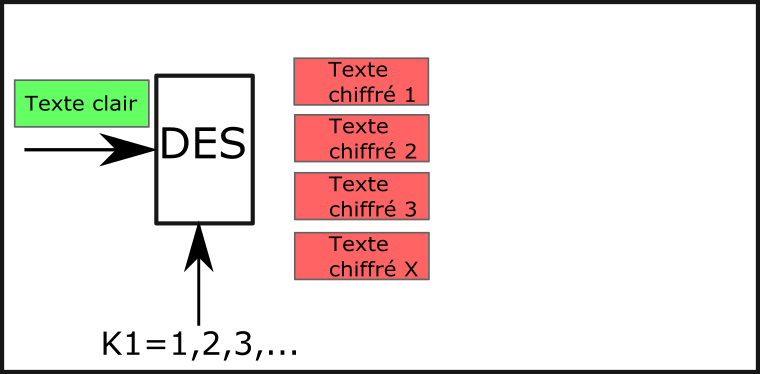
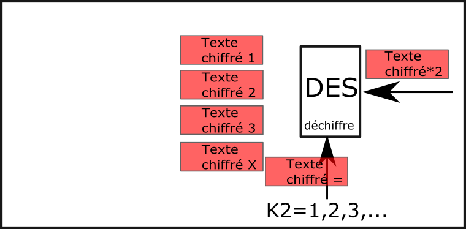
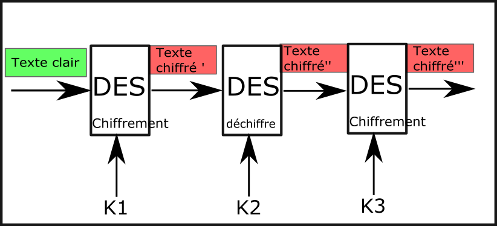

# Exercice 6 – Chiffrement par blocs (Blocks Ciphers)

## Informations  

**Évaluation** : formative  
**Type de travail** : individuel  
**Durée** : 3 heures  
**Système d’exploitation** : Windows, Linux ou MAC  
**Environnement** : python  

## Objectifs

Cet exercice a pour objectifs :

* Utiliser une implémentation de chiffrement par blocs.
* Comprendre qu’il n’est pas toujours facile d’améliorer un algorithme.
* Faire une attaque par texte connu.

Dans cet exercice, nous allons utiliser une implémentation de chiffrement par blocs. Nous allons utiliser une implémentation de DES. Nous allons utiliser un algorithme déjà implémenté, car c’est un algorithme très complexe. Ensuite, vous allez essayer d’améliorer DES en faisant un double DES. Puis, vous allez faire une attaque par texte connu choisi sur votre implémentation de double DES pour en voir sa faiblesse.

### Partie 1 : Utiliser DES

Nous allons débuter par utiliser une implémentation de DES. Il existe plusieurs implémentations de DES (personnelles ou dans des librairies), nous allons utiliser celle-ci : <https://gist.github.com/eigenein/1275094>.

Vous pouvez directement télécharger le fichier et le placer dans le même dossier que votre document contentant votre code ou vous pouvez cloner le dépôt git.

Par les commentaires du début, vous pouvez voir que le code est du domaine public. Les commentaires du début contiennent également l’utilisation du code.

Si vous faites le tour du code, vous pouvez voir la complexité d’implémenter un algorithme comme celle-là. Petite note, ce code contient une implémentation de DES, mais également une implémentation de 3DES.

#### Étape 1 : Utilisation de DES

1. Au début des commentaires de pyDes.py on vous indique comment initialiser la classe et des exemples d’utilisation des méthodes.

Pour initialiser un objet, on a besoin d’une clé de 8 octets, du mode (ECB ou CBC) et d’un vecteur d’initialisation si l’on utilise CBC. On peut également déterminer un caractère de remplissage (padding) et le mode de remplissage.

Créez-vous un document DES.py et inclure le code suivant :

```python
# DES01.py

# Import l'implémentation de DES
# https://gist.github.com/eigenein/1275094
from pyDes import *

# Notre message un peu spécial
message = b"0123456701234567"

# On utilise la même clé que dans les commentaires
# La clé doit avoir 8 octets, dont les 8 caractères
key = b"DESCRYPT"

# Un vecteur d’initialisation, encore comme
# dans les commentaires, on utilise 8 zéros.
# Ce vecteur n'est pas utilisé dans le
# mode ECB, notre premier mode utilisé.
iv = bytes([0]*8)

# On crée notre objet clé, on ne met pas de
# caractère de padding et on utilise
# le mode de padding recommandé
k = des(key, ECB, iv, pad=None, padmode=PAD_PKCS5)

# On chiffre le message
secret = k.encrypt(message)

# On va comparer la longueur du message original
# avec celui chiffré.
print("Longueur du texte plain : ", len(message))
print("Longueur du texte chiffré : ", len(secret))

# On imprime les 3 blocs de messages
print("Premier bloc chiffré : ", secret[0:8])
print("Deuxième bloc chiffré : ", secret[8:16])
print("Le reste chiffré : ", secret[16:])

# On déchiffre ici
message = k.decrypt(secret)
print("Notre message déchiffré : ", message)
```  

Exécutez votre code.

Est-ce que le message chiffrer à la même longueur que celui en texte clair ?

<details>
<summary markdown="span">Réponse :</summary>
Non, il a un bloc de plus. C’est à cause du padding PKCS5.
</details>  

Décrire ce que vous remarquez à propos des 3 blocs affichés.

<details>
<summary markdown="span">Réponse :</summary>

Les deux premiers blocs sont identiques.
Le troisième est le padding.

```bash
$ python3 DES01.py
Longueur du texte plain :  16
Longueur du texte chiffré :  24
Premier bloc chiffré :  b'\xa9\xe2\xa1-\x00\xe09\xb7'
Deuxième bloc chiffré :  b'\xa9\xe2\xa1-\x00\xe09\xb7'
Le reste chiffré :  b'\x00\xb1\xc4\xec\x90\xea\xa3\xde'
Notre message déchiffré :  b'0123456701234567'
```   
</details>  

En consultant le lien Web <https://en.wikipedia.org/wiki/Block_cipher_mode_of_operation#Electronic_codebook_(ECB)>, expliquez pourquoi les 2 premiers blocs sont identiques.

2. Changez le mode de ECB à CBC.

```python
k = des(key, CBC, iv, pad=None, padmode=PAD_PKCS5)
```  

Exécutez votre code.

Les deux premiers sont-ils toujours identiques ?

<details>
<summary markdown="span">Réponse :</summary>
Non.
</details>  

Consultez le lien <https://en.wikipedia.org/wiki/Block_cipher_mode_of_operation#Cipher_block_chaining_(CBC)>, pour expliquer pourquoi les blocs sont différents cette fois.

<details>
<summary markdown="span">Réponse :</summary>
En mode CBC, chaque bloc de texte en clair est XOR avec le bloc de texte chiffré précédent avant d'être chiffré. De cette façon, chaque bloc de texte chiffré dépend de tous les blocs de texte en clair traités jusqu'à ce point. Pour rendre chaque message unique, un vecteur d'initialisation doit être utilisé dans le premier bloc.
</details>  

Changez le vecteur d’initialisation pour des 1 pour voir le changement dans les blocs.

<details>
<summary markdown="span">Modification à faire :</summary>  

```python
iv = bytes([1]*8)
```  

</details>  

#### Étape 2 : Modifier le texte chiffré

1. Revenons à notre exemple de l’exercice 5 où Alice transfère 10$ à Bob, mais Bob n’est pas content et il veut modifier la transmission pour un montant de 1000$.

Est-il possible de faire la même chose avec le chiffrement par blocs ?

Modifiez le message pour le message d’Alice suivant (il y a 4 espaces après :).

```python
message = b"Vers Bob:    10$"
```  

Remettre le mode de la clé à ECB.

Modifiez la partie chiffrement et déchiffrement comme suit :

```python
# Alice envoie son message à la banque
secret = k.encrypt(message)
print("Longueur du texte plain : ", len(message))
print("Longueur du texte chiffré : ", len(secret))
print("Message chiffré d'Alice : ", secret)

# Bob se place entre Alice et la banque

# La banque déchiffre ici
message = k.decrypt(secret)
print("Notre message déchiffré : ", message)
```  

Exécutez votre code pour s’assurer que tout fonctionne. Sinon, dépanner.

2. Bob veut modifier le texte pour recevoir 1000$. Comme pour le chiffrement par flux, il n’a pas accès à la clé, seulement au texte chiffré.

En consultant la partie 2, étape 2 de l’exercice 5, ajouter la fonction `modification(secret)` à votre code. Attention, les caractères à modifier ne sont pas les mêmes, vous devez faire le bon calcul (n’oublier pas le premier caractère est 0).

Ajoutez également l’appel de la fonction et imprimez le texte chiffré (secret) modifié sous le commentaire de Bob.

Exécutez votre code.

Bob a-t-il réussi à modifier le message d’Alice ?

<details>
<summary markdown="span">Réponse :</summary>
Non.  

```bash
$ python3 DES02.py
Longueur du texte plain :  16
Longueur du texte chiffré :  24
Message chiffré d'Alice :  b'}P\xbf$\x07\xef\xa4\xfc\xef\xa7\x17o\x16\xc8F\xd7\x00\xb1\xc4\xec\x90\xea\xa3\xde'
Message chiffré de Bob :  b'}P\xbf$\x07\xef\xa4\xfc\xef\xa7\x17~\x06\xc9F\xd7\x00\xb1\xc4\xec\x90\xea\xa3\xde'
Notre message déchiffré :  b'Vers Bob\xa0R\x8a\xad\x1e\xf0\x85i'
```  
</details>  

Ça nous démontre que l’algorithme DES utilise un autre moyen pour chiffrer.

Que remarquez-vous à propos du texte déchiffré ? Vous pouvez également comparer les textes chiffrés d’Alice et de Bob.

<details>
<summary markdown="span">Réponse :</summary>
On voit que le début du texte est déchiffré et le reste n’est pas lisible. Les 8 premiers caractères (un bloc de 64 bits) ne sont pas touchés par la modification. Par contre, on a « scrapé » l’autre bloc.  
</details>  

Si l’on regarde le mode ECB, chaque bloc est chiffré indépendamment de l’autre. Donc, si l’on change des bits du texte chiffré du bloc 2, on rend le bloc inutilisable, cependant, le bloc 1 reste intact.

  
**Figure 1 : mode ECB.**

3. Deux choses que nous devons vérifier. Si l’on change seulement 1 bit, à quel point ça influence le texte chiffré ? Puis, si l’on ajoute du texte dans le troisième bloc sera-t-il également inutilisable ?

Dans la fonction `modification(secret)`, nous allons remplacer la partie où on modifie les caractères 11 à 13 par du code qui modifie seulement un bit :

```python
# On modifie 1 bit, du 2e bloc
# comme on a déjà des 0,
# le 1 va mettre seulement
# un bit à 1.
mod[8] = 1
```  

Exécutez votre code.

Le code est-il toujours inutilisable ?

<details>
<summary markdown="span">Réponse :</summary>
Oui.  

```bash
$ python3 DES03.py
Longueur du texte plain :  16
Longueur du texte chiffré :  24
Message chiffré d'Alice :  b'}P\xbf$\x07\xef\xa4\xfc\xef\xa7\x17o\x16\xc8F\xd7\x00\xb1\xc4\xec\x90\xea\xa3\xde'
Message chiffré de Bob :  b'}P\xbf$\x07\xef\xa4\xfc\xee\xa7\x17o\x16\xc8F\xd7\x00\xb1\xc4\xec\x90\xea\xa3\xde'
Notre message déchiffré :  b'Vers Bob.\x15-\x94\xf7\xc2\x17j'
```  
</details>  

Effectivement, si l’on change seulement 1 bit dans un bloc, il n’est plus possible de récupérer l’information de ce bloc. C’est une fonctionnalité intéressante de cet algorithme.

Maintenant, vérifions si un bloc « briser » détruit le reste des blocs chiffrés. Changez le texte d’Alice pour le suivant :

```python
message = b"Vers Bob:    10$ et lui souhaiter bonne chance."
``` 

Exécutez votre code.

Les blocs suivant le bloc modifié sont-ils perdus ?

<details>
<summary markdown="span">Réponse :</summary>
Non. Un bloc modifié devient inutilisable, par contre comme les blocs sont indépendants l’un de l’autre, les autres blocs continuent à être utilisables.  

```bash
$ python3 DES04.py
Longueur du texte plain :  47
Longueur du texte chiffré :  48
Message chiffré d'Alice :  b'}P\xbf$\x07\xef\xa4\xfc\xef\xa7\x17o\x16\xc8F\xd7\x96\xee\xf4\x02\x1f\xdb^\x11\xd7\xbf\xd2Q\xc1\x00\xc3\x11\x05\xc0A\xdb\x8aK\xda\xd2\xc5\x87\xb9\xa4J`@Y'
Message chiffré de Bob :  b'}P\xbf$\x07\xef\xa4\xfc\xee\xa7\x17o\x16\xc8F\xd7\x96\xee\xf4\x02\x1f\xdb^\x11\xd7\xbf\xd2Q\xc1\x00\xc3\x11\x05\xc0A\xdb\x8aK\xda\xd2\xc5\x87\xb9\xa4J`@Y'
Notre message déchiffré :  b'Vers Bob.\x15-\x94\xf7\xc2\x17j et lui souhaiter bonne chance.'
```  
</details>  

4. Si l’on regarde le mode CBC maintenant. Pour le déchiffrement, le premier bloc dépend de la clé et du vecteur d’initialisation (IV).

  
**Figure 2 : le premier bloc dépend de la clé et du vecteur d’initialisation (IV).**

Si l’on modifie le texte chiffré du deuxième, il devrait devenir inutilisable.

  
**Figure 3 : bloc 2 modifiés.**

Dans ce mode, le troisième bloc dépend du deuxième bloc. Donc, si le deuxième bloc est inutilisable devient-il également inutilisable ?

  
**Figure 4 : le bloc 3 dépend du bloc 2.**  

Changez le mode dans l’initialisation de la clé à CBC.

```python
k = des(key, CBC, iv, pad=None, padmode=PAD_PKCS5)
```  

Exécutez votre code.

Hum! On remarque que le caractère d’espace après le $ est détruit, mais le reste est intact.

Essayer de changer un bit du 9e octet au lieu du 8e (dans la fonction modification, changer le `mod[8]` à `mode[9]`).

Exécutez votre code.

Maintenant, le caractère espace est revenu, mais le prochain caractère, « e », est changé.

Par contre, le reste du bloc est toujours utilisable. Donc, s’il y a une erreur lors de la transmission (1 bit qui flippe à cause d’un glitch du réseau), on ne perd pas toute la communication.

### Partie 2 : double DES

Le chiffrement DES a été cassé en 1999[[1]](#footnote-1), il n’est donc plus considéré sécuritaire. Alors, on va modifier notre chiffrement pour le rendre plus sécuritaire, on va faire un double DES ;).

Double DES est, comme le nom le dit, utilisé l’algorithme DES deux fois.

Notre version de double DES aura une clé plus petite pour la discussion, car le but est de démontrer que faire un double DES n’augmentera pas la sécurité.

#### Étape 1 : on fait un double DES

1. Dans le même dossier que `pyDes.py`, créer un nouveau document `DoubleDES.py`.

Ajoutez le code suivant à votre document `DoubleDES.py` :  

```python
# DoubleDES01.py
from pyDes import *
import random

# Notre message à envoyer
message = b"01234567"

# On génère une clé de 1 octet (petite clé)
key_11 = random.randrange(0, 256)

# On inclut la petite clé dans 8 octets.
# C'est ce qui est demandé par l'implémentation
# de DES que l'on utilise.
# On fait du padding avec les autres octets.
key_1 = bytes([key_11, 0, 0, 0, 0, 0, 0, 0])

# On se crée une 2e clé de la même façon.
key_21 = random.randrange(0, 256)
key_2 = bytes([key_21, 0, 0, 0, 0, 0, 0, 0])

# Notre vecteur d'initialisation pour CBC.
iv = bytes([0] * 8)

# Nos objets clés DES
k1 = des(key_1, ECB, iv, pad=None, padmode=PAD_PKCS5)
k2 = des(key_2, ECB, iv, pad=None, padmode=PAD_PKCS5)

# Alice envoie un message à Bob
# On chiffre le message 2 fois avec 2 clés différentes.
# Pour une meilleure sécurité. ;)
secret = k2.encrypt(k1.encrypt(message))
print("La clé 11 : ", key_11)
print("La clé 21 : ", key_21)
print("Le message chiffré d'Alice : ", secret)

# Bob reçoit le message d'Alice
message = k1.decrypt(k2.decrypt(secret))
print("Le message que Bob reçoit : ", message)

# Eve s'attaque au Double DES
```  

Exécutez votre code.

Vérifiez que vos deux clés sont affichées, que le message d’Alice est bien chiffré et que Bob peut bien déchiffrer le message. Sinon, dépanner.

2. Maintenant, on regarde Eve qui veut attaquer notre double DES.

Comme on chiffre 2 fois, avec une clé de 8 bits, on se dit que nous avons 16 bits de sécurité. En réalité, en chiffrant 2 fois, on ajoute seulement un bit de sécurité. C’est ce que nous allons démontrer. Nous allons essayer de trouver les clés de chiffrement. On se rappelle que la sécurité moderne réside dans garder la clé secrète et non l’algorithme.

Si on fait une attaque de force brute, essayer toutes les clés, on essaie 2 fois une clé de 8 bits. Donc, si l’on multiplie par deux, c’est comme ajouter 1 bit.

Dans notre attaque, on n’aura pas une boucle à l’intérieur d’une boucle, mais plutôt deux boucles consécutives. Une première boucle pour trouver la première clé et la deuxième pour trouver la deuxième clé. C’est pour cette raison que si nous trouvons les clés nous allons pouvoir affirmer que nous ajoutons seulement un bit de sécurité : deux recherches consécutives de 8 bits c’est un espace clé de 9 bits. Si nous devions faire une boucle dans une boucle, nous aurions une clé de 16 bits.

Nous allons faire une attaque par texte clair choisi.

Avec la première boucle, nous allons nous construire une table de recherche. Nous allons chiffrer notre texte choisi avec toutes les possibilités de clés dans la table de recherche.

Avec la deuxième boucle, nous allons déchiffrer une fois le texte chiffré avec toutes les possibilités de clés. À chaque itération, nous allons comparer le texte chiffré avec les valeurs de notre table de recherche de texte chiffré une fois. De cette manière, nous ne devrions pas être obligés de faire toutes les possibilités de la deuxième clé.

Ajoutez, sous Eve, le code suivant à votre document :

```python
# Eve s'attaque au Double DES
# Nous allons utiliser une table de recherche
lookup = {}

# Notre première boucle pour trouver la première clé.
# Nous avons une clé de 8 bits, donc 256 possibilités.
# Nous allons remplir une table de recherche
# avec toutes les possibilités de la première clé.
for i in range(256):
	# On se crée une clé
	k = bytes([i, 0, 0, 0, 0, 0, 0, 0])

	# On se crée un objet clé DES
	k = des(k, ECB, iv, pad=None, padmode=PAD_PKCS5)
	
	# On met le texte chiffré du texte connu
	# dans la table de recherche
	lookup[k.encrypt(message)] = i

# Notre deuxième boucle va trouver la deuxième clé.
# On déchiffre une fois avec toutes les possibilités
# de clé. À chaque itération, on vérifie le texte
# déchiffré avec les entrées de notre table de
# recherche. Si on a une équivalence, on a
# trouvé les 2 clés
for i in range(256):
	# On se crée une clé
	k = bytes([i, 0, 0, 0, 0, 0, 0, 0])

	# On se crée un objet clé DES
	k = des(k, ECB, iv, pad=None, padmode=PAD_PKCS5)
	
	# On vérifie si le texte déchiffré
	# une fois est dans notre table
	# de recherche. Si oui, Bingo!
	if k.decrypt(secret) in lookup:
		# On affiche la clé 1
		print("Clé k_11 : ", lookup[k.decrypt(secret)])
		# On affiche la clé 2
		print("Clé k_21 : ", i)
		# On n’a plus rien à faire.
		break
```  

Exécutez votre code.

Avons-nous trouvé les deux clés ?

<details>
<summary markdown="span">Réponse :</summary>
Oui et non.  
</details>  

On semble être proche, mais pas tout à fait. Si l’on exécute notre code plusieurs fois, on peut découvrir que quelquefois nous avons exactement la clé, mais les autres fois nous sommes juste à côté de 1. En réalité, on voit que nous sommes toujours à un bit près de la vraie clé.

3. Essayons de voir si l’on est capable de déchiffrer le message chiffré avec les clés de Eve.

Dans le « if » où nous avons trouvé les clés, ajoutez le code pour déchiffrer le message. Vous devez :

* Créer la clé 1 avec la valeur trouvée dans la table de recherche.
* Créer la clé 2 avec la valeur où la boucle est rendue (i).
* Générer un objet clé 1 avec la clé 1.
* Générer un objet clé 2 avec la clé 2.
* Déchiffrer avec l’objet clé 2 en premier, puis avec l’objet clé 1 (voir Bob).

Exécutez votre code.

Avons-nous déchiffré le message avec les clés d’Eve ?

<details>
<summary markdown="span">Réponse :</summary>
Oui.  
</details>  

On peut voir que notre bit le moins significatif n’influence pas le chiffrement (il n’est pas utilisé).

Vous devez également comprendre que pour ce genre d’attaque, la table de recherche est vraiment importante. Vous devez trouver une méthode pour la créer efficacement : ici, on a un peu triché en utilisant une attaque de texte connu. Si nous avions utilisé une clé de 56 bits, sa création aurait été beaucoup, beaucoup plus longue.

Donc, double DES est un chiffrement l’où l’on chiffre deux fois la même chose avec deux clés différentes.

  
**Figure 5 : double DES.**

Comme on vient de voir, ce n’est pas un algorithme très sécuritaire, car nous avons réussi à trouver les clés assez rapidement.

Nous avons fait une attaque de texte connu. Nous avons commencé par utiliser notre texte connu pour nous créer une table de recherche. Nous avons fait une boucle qui chiffrait le texte connu avec toutes les clés possibles.

  
**Figure 6 : boucle qui chiffre le texte connu avec toutes les clés possibles.**

Puis, on a fait une boucle qui déchiffre une fois le texte chiffré et compare la valeur trouvée avec les valeurs dans la table de recherche. Si l’on trouve une équivalence, on a les deux clés.

  
**Figure 7 : boucle qui déchiffre une fois le texte chiffré et compare la valeur trouvée avec les valeurs dans la table de recherche.**

Double DES n’a jamais été utilisé. Par contre, 3DES oui.

3DES chiffre avec une clé, déchiffre le premier texte chiffré avec une deuxième clé et chiffre le nouveau texte chiffré avec une 3e clé.

  
**Figure 8 : 3DES.**

L’attaque que nous venons d’effectuer ne fonctionne plus avec 3DES.

Naturellement, le déchiffrement est la réciproque : déchiffre avec la clé 3, chiffre avec la clé 2 et déchiffre avec la clé 1.

L’avantage de cette méthode c’est en utilisant la même clé (k1=k2=k3), nous retrouvons DES. Donc, l’algorithme est rétrocompatible avec DES[[2]](#footnote-2).

Consultez le lien <https://en.wikipedia.org/wiki/Triple_DES> pour plus d’informations sur 3DES.

Compétences développées

| **FW19** – Distinguer les éléments de la cryptographie et de la cryptanalyse. | **FW19 # 1** – Reconnaître les étapes historiques de la cryptographie.<br>**FW19 # 2** – Comparer les différentes méthodes actuelles de cryptographie.<br>**FW19 # 3** – Expliquer les éléments de la cryptanalyse. |
| :--- | :--- |

**Note** : les compétences sont développées en partie.

Références

<https://en.wikipedia.org/wiki/Block_cipher_mode_of_operation>

<https://en.wikipedia.org/wiki/Data_Encryption_Standard>

<https://en.wikipedia.org/wiki/Triple_DES>

<https://docs.python.org/3/library/functions.html?highlight=ord#ord>

<https://docs.python.org/3/library/random.html?highlight=random#module-random>

<https://docs.python.org/3/howto/unicode.html>

<https://www.geeksforgeeks.org/python-operators/>

##

1. <https://en.wikipedia.org/wiki/Data_Encryption_Standard> [↑](#footnote-ref-1)
2. <https://en.wikipedia.org/wiki/Triple_DES#Keying_options> [↑](#footnote-ref-2)