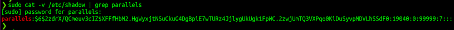

# Exercice 10 – Fonctions de hash et signature numérique

## Informations

**Évaluation** : formative  
**Type de travail** : individuel  
**Durée** : 2 heures  
**Système d’exploitation** : Windows, Linux ou MAC  
**Environnement** : python  

## Objectifs

Cet exercice a pour objectifs :

* Implémenter une fonction de hachage avec hashlib.
* Comprendre comment fonctionne la signature numérique.
* Comprendre le « salage » (salt).

Dans cet exercice, nous allons comprendre le hachage en l’implémentant avec la librairie hashlib. Nous allons également comprendre le fonctionnement de la signature numérique en l’implémentant avec RSA. Finalement, nous allons essayer de comprendre le principe de « salage » (salt).

### Partie 1 : Fonctions de hachage

On n’implémentera pas une fonction de hachage de zéro, comme le chiffrement par bloc, son implémentation est très complexe. Python possède des librairies avec ces fonctions déjà implémentées.

#### Étape 1 : à sens unique et déterministe

1. Créer un nouveau document `HashFunctions.py`.

Python possède la librairie hashlib, naturellement notre premier réflexe est d’aller consulter la documentation de Python : <https://docs.python.org/3/library/hashlib.html?highlight=hashlib#module-hashlib>. On peut voir que cette librairie implémente plusieurs fonctions de hachage. Il y a un avertissement que certains algorithmes possèdent des faiblesses par rapport aux collisions.

Nous avons de l’information sur son utilisation :

« Il existe une méthode constructrice nommée pour chaque type de hachage. Tous renvoient un objet de hachage avec la même interface simple. Par exemple : utilisez sha256() pour créer un objet de hachage SHA-256. Vous pouvez maintenant alimenter cet objet avec des objets de type octets (normalement des octets) en utilisant la méthode update(). À tout moment, vous pouvez lui demander le résumé de la concaténation des données qui lui ont été transmises jusqu'à présent en utilisant les méthodes digest() ou hexdigest(). »

Nous avons également un exemple d’utilisation de l’algorithme sha256. Parfait, faisons ça.

```python
# HashFunctions.py
import hashlib

# Notre message, il doit être binaire.
m = "Nobody inspects the spammish repetition".encode()

# On utilise l'algorithme sha256.
sha256 = hashlib.sha256()

# On met à jour l'objet
sha256.update(m)

# On récupère le hash
d = sha256.digest()

# On affiche notre hash
print("Le hash de sha256 :", d)
```  

Exécutez votre code.

Avez-vous un hachage ?  

<details>
<summary markdown="span">Réponse :</summary>  
Oui.

```bash
$ python3 HashFunctions01.py
Le hash de sha265 : b'\x03\x1e\xdd}Ae\x15\x93\xc5\xfe\\\x00o\xa5u+7\xfd\xdf\xf7\xbcN\x84:\xa6\xaf\x0c\x95\x0fK\x94\x06'

``` 
</details>  

2. Si l’on refait un hachage du même texte, nous sommes censés retrouver la même valeur de hachage.

Dans votre code, créer un deuxième objet sha256 (sha256bis) et refaire les étapes pour générer une nouvelle valeur de hachage avec le même texte.

```python
###Ajouter votre code###
```  

Exécutez votre code.

Comparez les deux valeurs. Sont-elles identiques ?

<details>
<summary markdown="span">Réponse :</summary>  
Oui.

```bash
$ python3 HashFunctions02.py
Le hash de sha265 : b'\x03\x1e\xdd}Ae\x15\x93\xc5\xfe\\\x00o\xa5u+7\xfd\xdf\xf7\xbcN\x84:\xa6\xaf\x0c\x95\x0fK\x94\x06'
Le hash de sha265bis : b'\x03\x1e\xdd}Ae\x15\x93\xc5\xfe\\\x00o\xa5u+7\xfd\xdf\xf7\xbcN\x84:\xa6\xaf\x0c\x95\x0fK\x94\x06'

``` 
</details>  

Donc, notre fonction de hachage est déterministe : avec la même entrée, elle génère la même valeur de hachage.

#### Étape 2 : la sortie est dépendante de tous les bits d’entrées

1. Vérifions que si un seul bit de l’entrée est modifié, nous allons avoir une sortie complètement différente.

Nous allons ajouter une fonction `modify(m)`.

Ajoutez le code suivant à votre code.

```python
# La fonction va au début de votre code.
def modify(m):
	"""
	Fonction
	modify(m)
	Modifie un bit du message reçu.
	
	Paramètres
	m (bytes) : message à modifier.
	
	Return
	(bytes) : message avec un bit de flippé.
	"""
	
	l = list(m)
	# Flip un bit
	l[0] = l[0] ^ 1

	return bytes(l)

# Ce code va entre les deux parties de code qui
# génèrent un code de hachage.
# Avant sha254bis.
# On modifie un bit du message
m = modify(m)
print("Notre message modifié :", m)
```  

Exécutez votre code.

Comparez les deux valeurs. Sont-elles différentes ?

<details>
<summary markdown="span">Réponse :</summary>  
Oui.

```bash
$ python3 HashFunctions03.py
Le hash de sha265 : b'\x03\x1e\xdd}Ae\x15\x93\xc5\xfe\\\x00o\xa5u+7\xfd\xdf\xf7\xbcN\x84:\xa6\xaf\x0c\x95\x0fK\x94\x06'
Notre message modifié : b'Oobody inspects the spammish repetition'
Le hash de sha265bis : b'[Gd\xa3\xffwdT\xfb\x96\xa0\xb8p\xb9\xe5\xe2\xca\xffBc\x80\xf0\x0b\x14P\xc4I\x1f\xcc\xdd\xb1F'

``` 
</details>  

Donc, la sortie de notre fonction de hachage est dépendante de tous les bits en entrée.

Les deux dernières propriétés sont plus difficiles à prouver. On peut quand même voir que la sortie est uniformément distribuée. Par contre, il est vraiment compliqué de générer une collision (casser l’algorithme de sha256), mais si vous voulez vous pouvez vous amuser à essayer. 😁

### Partie 2 : Signature numérique

RSA nous permets de signer des messages. Si vous allez à la page Wikipédia de RSA (<https://en.wikipedia.org/wiki/RSA_cryptosystem#Signing_messages>), on vous explique comment faire.

« Supposons qu'Alice souhaite envoyer un message signé à Bob. Elle peut utiliser sa propre clé privée pour le faire. Elle produit une valeur de hachage du message, l'élève à la puissance d (modulo n) (comme elle le fait lors du décryptage d'un message) et l'attache en tant que "signature" au message. »

On nous explique également comment fait Bob pour vérifier le message avec la signature d’Alice.

« Lorsque Bob reçoit le message signé, il utilise le même algorithme de hachage en conjonction avec la clé publique d'Alice. Il élève la signature à la puissance e (modulo n) (comme il le fait lors du chiffrement d'un message) et compare la valeur de hachage résultante avec la valeur de hachage du message. Si les deux sont identiques, il sait que l'auteur du message était en possession de la clé privée d'Alice et que le message n'a pas été falsifié depuis son envoi. »

#### Étape 1 : Alice signe un message à Bob

1. Créer un nouveau document `SignatureNumerique.py`.

Pour débuter, nous avons besoin de clés RSA. Utilisez votre script de l’exercice 9 sur le RSA pour générer des clés RSA.

Voici mon résultat :

```bash
**********
Clés publiques (e, n) : 5 199841
Clé secrète (d) : 4973
**********
```  

La première étape est de générer une valeur de hachage du message.

Ajoutez le code suivant à votre fichier et complétez le code manquant.

```python
# SignatureNumerique.py
import hashlib

# Les clés RSA d'Alice généré par le
# script RSA de l'exercice 9
# **********
# Clés publiques (e, n) : 5 199841
# Clé secrète (d) : 4973
# **********

# On assigne ces clés à des variables
n = 199841
e = 5
d = 4973

# Le message qu'Alice veut signer et envoyer à Bob.
message = "A martini. Shaken, not stirred.".encode()

# Étape 1 : hachage du message
###Vous devez ajouter votre code###
# Ajoutez le code manquant pour générer un hash sha256.
# Vous devez créer un objet sha256.
# Faire un « update » de l’objet avec le message.
# Générer le hash et l’assigner à une variable h.

# La valeur de h est en octets, nous avons
# besoin d'une valeur numérique (un entier).
h = int.from_bytes(h, 'big')
print("Hachage du message :", h)
```  

Exécutez votre code.

Avez-vous une valeur de hachage ?

<details>
<summary markdown="span">Réponse :</summary>  
Oui.

```bash
$ python3 SignatureNumerique02.py
Hachage du message : 83233905888608736456313251388043055743487910516350705733932215963920472340264

``` 
</details>  

La valeur est très grande, ce qui est parfait pour une bonne sécurité. Pour notre test, nous allons diminuer un peu sa valeur.

Modifiez votre code pour diminuer la longueur du hachage.

```python
h = int.from\_bytes(h, 'big') % n
```  

Exécutez votre code et si vous n’avez pas une valeur de hachage plus petite, dépannez.

2. La deuxième étape est de chiffrer (ou déchiffré du point de vue d’Alice) la valeur de hachage.

La troisième étape est d’attacher la signature au message et d’envoyer le tout.

Ajoutez le code suivant à votre code.

```python
# Étape 2 : "déchiffré" la valeur de hachage.
# Elle utilise sa clé secrète d.
signature = h**d % n

# Étape 3 : envoyer le message et la signature.
print("Message à Bob et sa signature (message, signature) :", message, signature)
```  

Exécutez votre code et assurez-vous d’afficher le message et sa signature.

3. Bob reçoit le message et il doit :  

	1. Trouver la valeur de hachage du message, comme Alice a fait.  
	2. Utiliser la clé publique d’Alice pour extraire, de la signature, la valeur de hachage générée par Alice.  
	3. Comparer les deux valeurs. S’elles sont identiques, Bob est certains qu’Alice à envoyer le message et qu’il n’a pas été modifié.  

Insérez le code suivant à votre code et complétez le code manquant.

```python
# Bob reçoit le message.
# Étape 1 : hachage du message

### Ajoutez le code pour trouver la valeur de hachage du message.###

print("Bob, hachage du message :", h)

# Étape 2-3 : vérifier la signature
verification = signature**e % n
print("Vérification de la signature :", verification)
```  

Exécutez votre code.

La valeur de hachage de Bob est-elle identique à la valeur dans la signature ?

<details>
<summary markdown="span">Réponse :</summary>  
Oui.

```bash
$ python3 SignatureNumerique04.py
Hachage du message : 71506
Message à Bob et sa signature (message signature) : b'A martini. Shaken, not stirred.' 9300
Bob, hachage du message : 71506
Vérification de la signature : 71506

``` 
</details>  

4. Que se passe-t-il si quelqu’un intercepte le message et tente de le modifier ? Bob, peut-il le détecter ?

Nous allons modifier un bit du message et voir si notre signature tient toujours.

Nous allons ajouter une fonction `modification(message)`.

Ajoutez la fonction suivante au début de votre code.

```python
def modification(m):
	"""
	Fonction
	modification(m)
	Modifie un bit de m
	
	Paramètres:
	m(bytes) : message à modifier
	
	Return
	(bytes) : message modifié
	"""
	
	# Convertis le message en une liste
	l = list(m)
	
	# Flip le premier bit
	l[0] = l[0] ^ 1
	
	return bytes(l)
```  

Juste avant Bob, insérer le code suivant.

```python
# Eve intercepte le message et le modifie.
message = modification(message)
print("Le message modifié d'Eve :", message)
```  

Exécutez votre code.

Est-ce que Bob a découvert que le message a été modifié ? Si oui, comment ?

<details>
<summary markdown="span">Réponse :</summary>  
Oui, car le hash de la signature ne correspond pas avec le hash du message.  

```bash
$ python3 SignatureNumerique05.py
Hachage du message : 71506
Message à Bob et sa signature (message signature) : b'A martini. Shaken, not stirred.' 9300
Le message modifié d'Eve : b'@ martini. Shaken, not stirred.'
Bob, hachage du message : 78213
Vérification de la signature : 71506

``` 
</details>  


### Partie 3 : Le salage (salt)

Dans cette partie, nous allons essayer de comprendre le principe du salage (salt). Plusieurs systèmes utilisent le salage pour sauvegarder les mots de passe des utilisateurs. Pourquoi?

Qu’est-ce qu’un sel (salt) ? Encore, si l’on se réfère à Wikipédia :

« En cryptographie, un sel est une donnée aléatoire qui est utilisée comme entrée supplémentaire dans une fonction unidirectionnelle qui hache des données, un mot de passe ou une phrase de passe. Les sels sont utilisés pour sauvegarder les mots de passe dans le stockage. »[[1]](#footnote-1)

#### Étape 1 : comprendre l’utilité du salage

1. Linux utilise le salage pour sauvegarder ses mots de passe.

Regardons une entrée du fichier /etc/shadow de Linux. La fonction de hash ici est sha512.


**Figure 1 : Entrée de mot de passe sha512 dans /etc/shadow.**  

Une entrée est divisée en plusieurs champs séparés par « : ». Nous allons ignorer les derniers champs et nous concentrer sur les deux premiers. Le premier représente le nom d’utilisateur et le deuxième le mot de passe.

```bash
parallels:$6$2zdrX/QCmeuv3cIZ$XFFfHbM2.HgWyxjtNSuCkuG4DgBpiE7wTURz4JjlygUkUgk1FpWC.2zwjUmTQ3VXPqo0KiDuSyvpMDVLhSSdF0:19040:0:99999:7:::
```  

Nous allons nous concentrer sur le champ de mot de passe. Ce champ est redivisé en d’autres champs débutant par « $ ».

$6$2zdrX/QCmeuv3cIZ$XFFfHbM2.HgWyxjtNSuCkuG4DgBpiE7wTURz4JjlygUkUgk1FpWC.2zwjUmTQ3VXPqo0KiDuSyvpMDVLhSSdF0

Le premier champ représente le type de chiffrement utilisé. Le 6 indique que le mot de passe est chiffré avec l’algorithme sha512 et un sel.

Le deuxième champ est le sel utilisé et le troisième champ le mot de passe.

**Note :** les champs du champ mot de passe vont varier avec l’algorithme utilisé.

Donc, nous avons trois pièces d’informations pour travailler. Le 6 nous indique comment le mot de passe est chiffré : SHA512 avec un sel. Le sel, on ajoute un sel au mot de passe. Ici, la valeur du sel est 2zdrX/QCmeuv3cIZ. Finalement, l’entropie qui est la valeur de hachage sauvegardée : XFFfHbM2.HgWyxjtNSuCkuG4DgBpiE7wTURz4JjlygUkUgk1FpWC.2zwjUmTQ3VXPqo0KiDuSyvpMDVLhSSdF0.

Nous allons comprendre l’utilité du sel en reproduisant l'entrée du fichier `/etc/shadow`. Notre résultat ne sera pas exactement comme l'entrée de `/etc/shadow`.

Malheureusement, l’algorithme exact utilisé par Linux pour SHA-512 est complexe, avec :
	•	Un algorithme de dérivation de clé spécial (non standard),
	•	Des permutations, concaténations, itérations personnalisées,
	•	Ce qui veut dire que le résultat n'est pas l'équivalent à un simple hashlib.sha512.

Créez un nouveau document `Shadow.py`.

Nous allons utiliser la méthode `hashlib.pbkdf2_hmac()` : <https://docs.python.org/3/library/hashlib.html#key-derivation>.

Selon la documentation de `hashlib.pbkdf2_hmac(hash_name, password, salt, iterations, dklen=None)`, nous avons besoin du nom de l'algorithme de hachage (hash\_name), du mot de passe (password), d'un sel (salt) et du nombre d'itérations (iterations). Avec sha512, nous n'avons pas besoin dklen.

Nous allons commencer par nous créer un mot de passe à la « shadow ».

Ajoutez le code suivant à votre fichier.

```python
# Shadow01.py
import hashlib
import base64
from hmac import compare_digest as compare_hash
import os

# On spécifie le salt.
# On utilise un salt aléatoire de 16 caractères.
salt = os.urandom(16)

# Notre mot de passe en clair.
password = 'password'

# Le nombre d'itérations pour le hash.
iterations=100000

# On génère notre hash
hash_value = hashlib.pbkdf2_hmac('sha512',password.encode(),salt,iterations)

# On imprime notre salt avec le mot de passe.
# En encode en base64 pour avoir une sortie qui ressemble à shadow.
print("Le mot de passe : ", base64.b64encode(salt).decode(),"$",base64.b64encode(hash_value).decode(),sep='')
```  

Exécutez votre code.

Avez-vous réussi à avoir un hash de mot de passe ?  

<details>
<summary markdown="span">Réponse :</summary>  
Oui.  

</details>  

On voit que notre code fonctionne, nous avons réussi à reproduire un système de hachage de mots de passe qui ressemble à Linux.

2. Que se passe-t-il si nous n’avons pas de sel et deux personnes entrent le même mot de passe ?

Pour commencer, nous allons modifier notre code pour créer une valeur de hachage sans sel.

Pour faire simple, nous allons tout simplement mettre un sel vide.

Modifiez votre code comme suit.

```python
# On spécifie le salt.
# On utilise un salt aléatoire de 16 caractères.
# salt = os.urandom(16)
salt = ''.encode()
``` 

Exécuter votre code pour s'assurer que tout fonctionne bien.  

Nous allons maintenant simuler deux personnes qui entrent le même mot de passe.

Remplacez la partie de code à partir du commentaire `# On génère notre hash` par le code suivant.

```python
Alice_value = hashlib.pbkdf2_hmac('sha512',password.encode(),salt,iterations)

# On génère le hash de Bob
Bob_value = hashlib.pbkdf2_hmac('sha512',password.encode(),salt,iterations)

# On compare les hash
if compare_hash(Alice_value, Bob_value):
    print("Les hash sont identiques.")
else:
    print("Bummer, ils ne sont pas identiques!")

# On imprime les salts avec les mots de passe.
# En encode en base64 pour avoir une sortie qui ressemble à shadow.
print("Le mot de passe d'Alice : ", base64.b64encode(salt).decode(),"$",base64.b64encode(Alice_value).decode(),sep='')
print("Le mot de passe de Bob : ", base64.b64encode(salt).decode(),"$",base64.b64encode(Bob_value).decode(),sep='')
```  

Exécutez votre code.

Comparez les valeurs de hachage. Que s’est-il passé ? Quel est le problème ?

<details>
<summary markdown="span">Réponse :</summary>  
Les deux valeurs sont identiques. Donc, quelqu’un qui a accès au fichier shadow peut voir quelles personnes ont les mêmes mots de passe. De plus, il est possible d’utiliser un Rainbow Table pour casser les mots de passe.    

```bash
$ python3 Shadow02.py
Les hash sont identiques.
Le mot de passe d'Alice : $3pO56jxSNWe4uO3iinQwjRrlO2D3M5JSbXRAyI7bOjej7mD9lUBkTx0curctv/Sg6tA27B3PM1uJcYver6Tsow==
Le mot de passe de Bob : $3pO56jxSNWe4uO3iinQwjRrlO2D3M5JSbXRAyI7bOjej7mD9lUBkTx0curctv/Sg6tA27B3PM1uJcYver6Tsow==
```

</details> 

3. Maintenant, nous allons créer des valeurs de hachage avec des sels différents.

Changez le début de votre code par le code suivant.

```python
# On spécifie le salt.
# On utilise un salt aléatoire de 16 caractères.
salt = os.urandom(16)
salt2 = os.urandom(16)
```  

Lors de la génération du hash, changez le sel de Bob par la deuxième valeur, salt2. Changez également l'impression de Bob.

```python
# On génère le hash de Bob
Bob_value = hashlib.pbkdf2_hmac('sha512',password.encode(),salt2,iterations)

...

print("Le mot de passe de Bob : ", base64.b64encode(salt2).decode(),"$",base64.b64encode(Bob_value).decode(),sep='')

```  

Exécutez votre code.

Avons-nous des valeurs de hachage différentes ?

<details>
<summary markdown="span">Réponse :</summary>  
Oui.    

```bash
$ python3 Shadow03.py
Bummer, ils ne sont pas identiques!
Le mot de passe d'Alice : B15abCw1gFKL3eljdwoWHA==$QvQsvHgt85C0GSoG7ifZxI2sngN2FYeK2xVbZt0EGofcxno3x1w2N1p917pKnfEw5dyssk1IV1QTDOgOLVM7FQ==
Le mot de passe de Bob : L5jSSyJ4lGL3gPYkV9opZA==$7KarFWsyJolhBKxfH+cZrI8QJ+B1Px2cvPULR12iPr+E2E9X0WVwAiKCbZHpc/nMQ3zJ0W+kBKTx+pwofqMM7g==
```

</details>

Le sel ajoute une partie aléatoire à notre mot de passe pour le rendre unique. Il n’est plus possible d’utiliser des Rainbow Tables pour casser les mots de passe.

Compétences développées

| **FW19** – Distinguer les éléments de la cryptographie et de la cryptanalyse. | **FW19 # 1** – Reconnaître les étapes historiques de la cryptographie.<br>**FW19 # 2** – Comparer les différentes méthodes actuelles de cryptographie.<br>**FW19 # 3** – Expliquer les éléments de la cryptanalyse. |
| :--- | :--- |

**Note** : les compétences sont développées en partie.

Références

<https://docs.python.org/3/library/hashlib.html?highlight=hashlib#module-hashlib>  
[https://en.wikipedia.org/wiki/RSA\_(cryptosystem)#Signing\_messages](https://en.wikipedia.org/wiki/RSA_%28cryptosystem%29#Signing_messages)  
<https://docs.python.org/3/library/stdtypes.html?highlight=int%20from_bytes#int.from_bytes>  
[https://en.wikipedia.org/wiki/Salt\_(cryptography)](https://en.wikipedia.org/wiki/Salt_%28cryptography%29)  
<https://docs.python.org/3/library/os.html>  
<https://docs.python.org/3/library/hashlib.html#key-derivation>  
<https://www.geeksforgeeks.org/python-operators/>  
<https://crypto.stackexchange.com/>

1. [https://en.wikipedia.org/wiki/Salt\_(cryptography)](https://en.wikipedia.org/wiki/Salt_%28cryptography%29) [↑](#footnote-ref-1)