# Exercice 11 – VPN - Topologies

## Informations

**Évaluation** : formative  
**Type de travail** : individuel  
**Durée** : 2 heures  
**Système d’exploitation** : Windows, Linux, pfsense  
**Environnement** : Virtuel  

## Objectifs

Cet exercice a pour objectifs :

* Créer une topologie pour les prochains exercices.
* Installer le coupe-feu pfsense.
* Installer des VMs pour compléter notre réseau test.

Dans cet exercice, nous allons préparer un environnement de laboratoire virtuel pour les prochains exercices.

Voici la topologie de base :

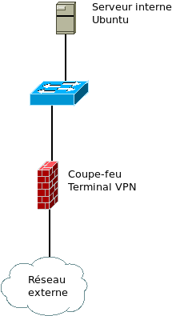  
**Figure 1 : Topologie de base.**  

Le coupe-feu/terminal VPN sera une VM pfsense. Le serveur interne sera une VM Ubuntu serveur. L’idée sera de pouvoir y faire une connexion SSH.  

Voici la topologie pour l’accès distant :  

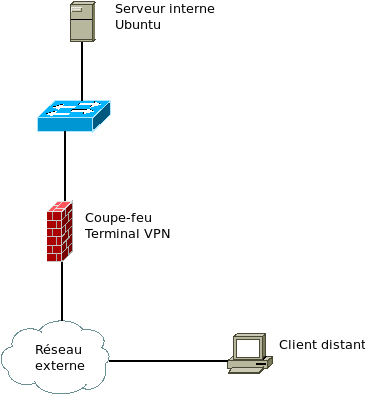  
**Figure 2 : Topologie accès distant.**  

Le client externe pourrait être l’ordinateur hôte ou une autre VM.  

Voici la topologie pour le site à site :  

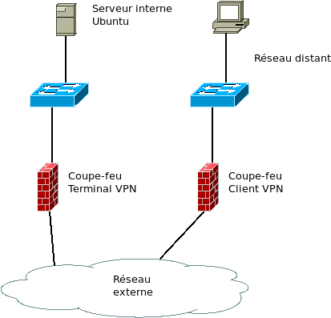  
**Figure 3 : Topologie site à site.**  

Le deuxième coupe-feu peut être un autre pfsense ou tout coupe-feu. Le client sera une VM Linux.

Pour vSphere, vous devez utiliser des adresses statiques dans les réseaux VM DFC3 et VM DFC4 et **désactiver les serveurs DHCP** de vos coupe-feu pfSense.

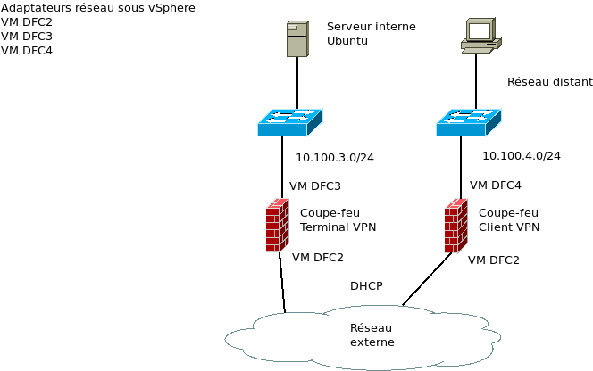  
**Figure 4 : Topologie site à site avec vSphere.**  

**Note :** les adresses de réseaux affichées sont celles fournies par le cégep et non celles qui seront utilisées pendant les exercices.

## Partie 1 : Installation de pfsense et configuration de l’espace virtuel

Dans cette partie, nous allons commencer par configurer l’espace virtuel de travail. Puis, nous allons installer le coupe-feu pfsense.

### Étape 1a : configuration de l’espace virtuel avec VMware Workstation  

1. Nous allons débuter par configurer notre espace virtuel : configurer notre topologie réseau.

La configuration suivante est pour VMware Workstation. Si vous utilisez un autre logiciel de virtualisation, vous allez devoir adapter.

VMware Workstation a déjà 3 réseaux : bridged, host-only et NAT.

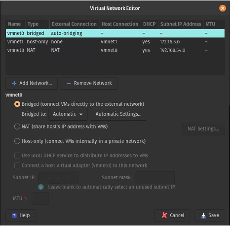  
**Figure 5 : Workstation réseaux virtuels.**

Pour la topologie d’accès distant, on peut utiliser le réseau host-only pour le réseau interne et le réseau bridged pour le réseau externe.

Pour la topologie site à site, nous avons besoin d’un autre réseau fermé, donc vous devez ajouter un deuxième réseau host-only.

Cliquez sur « Add Network… ».

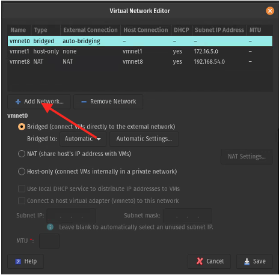  
**Figure 6 : ajouter un réseau.**

Choisissez Host-only, vous pouvez garder le nom du réseau suggérer et cliquez sur Add.

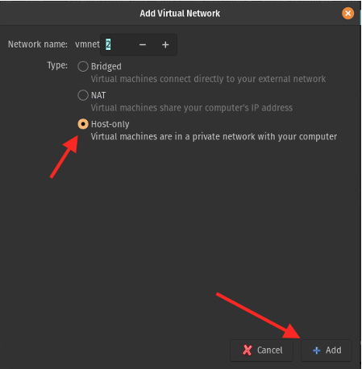  
**Figure 7 : configuration Host-only.**

Décocher le DHCP et configurez la plage réseau 192.168.10.0 255.255.255.0. Sauvegardez votre configuration.

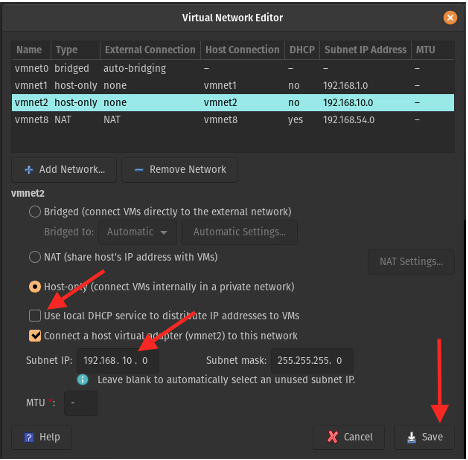  
**Figure 8 : configuration DHCP.**

Choisissez le premier host-only. Décocher le DHCP et configurez la plage réseau 192.168.1.0 255.255.255.0. Sauvegardez votre configuration.

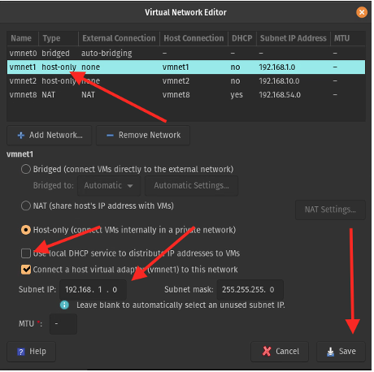  
**Figure 9 : configuration de vmnet1.**

### Étape 1b : configuration de l’espace virtuel dans vShpere

Sous vSphere, nous allons utiliser les réseaux déjà existants : VM DFC2, VM DFC3 et VM DFC4.  

## Partie 2 : installation de pfsense  

Pour l’installation de pfsense allons consulter la documentation : <https://docs.netgate.com/pfsense/en/latest/>.  

Pour le téléchargement de pfsense : <https://www.pfsense.org/download/>.  

Selon la documentation (<https://docs.netgate.com/pfsense/en/latest/hardware/minimum-requirements.html>), les spécifications minimales sont :  

* Processeurs : 2 cœurs.  
* Mémoires : 1 Go.  
* Disque : 8 Go.

Comme, nous allons seulement nous en servir pour le VPN, nous allons faire une installation minimale.  

### Étape 1a : création de la VM sous VMware Workstation  

Lancer la création d’une nouvelle VM en passant par le menu *File->New Virtual Machine*.  
Choisissez *Custom (advanced)* dans la fenêtre qui s’ouvre.

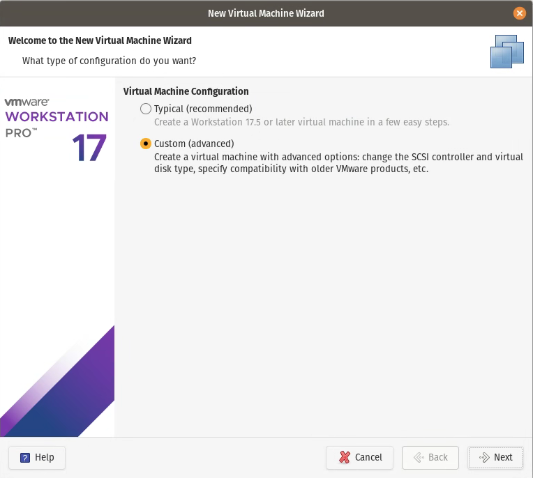  
**Figure 10 : créer la VM sous Workstation 1.**  

Dans la prochaine fenêtre, laisser la compatibilité telle quelle. À la prochaine fenêtre, choisir d’installer le système d’opération plus tard.

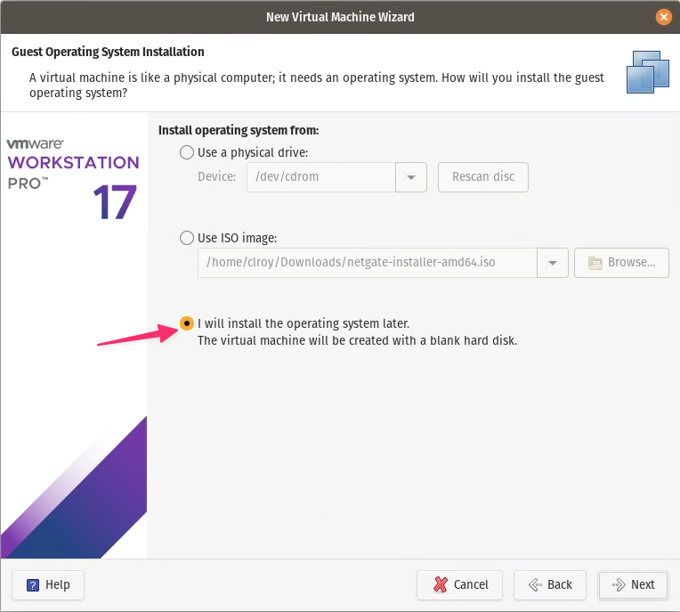  
**Figure 11 : créer la VM sous Workstation 2.**  

Dans la prochaine fenêtre, choisir autre pour le système d’opération invité et la version FreeBSD 12 64-bit.

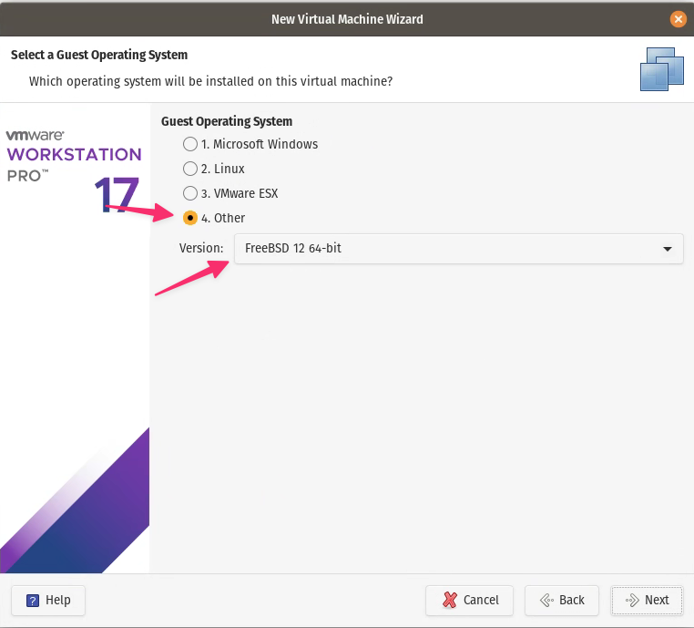  
**Figure 11 : créer la VM sous Workstation 3.**  

Dans la prochaine fenêtre, changez le nom de la VM pour *pfsense*.

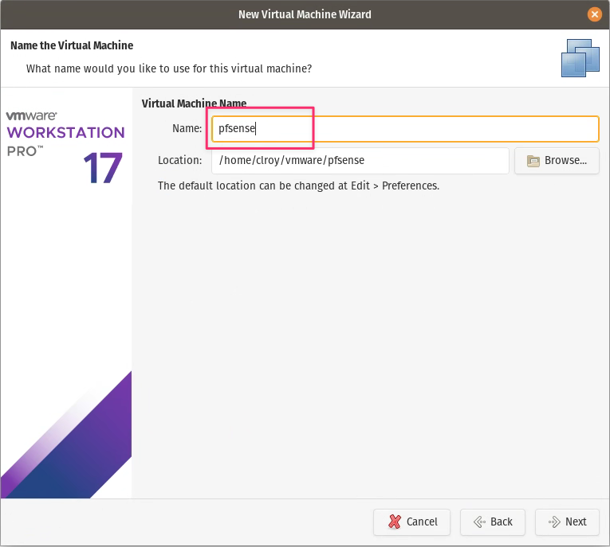  
**Figure 11 : créer la VM sous Workstation 4.**  

Dans la prochaine fenêtre, choisir 1 processeur et 2 cœurs par processeur.

Dans la prochaine fenêtre, choisir 1 Go (1024) de mémoire.

Dans la prochaine fenêtre, choisir le réseau *bridged*.

Pour les 3 prochaines fenêtres, garder les valeurs par défaut.

À la fenêtre de la grosseur du disque, choisir 10 Go.

Gardez la valeur par défaut pour le nom du disque et à la dernière fenêtre, vérifiez si tout est correct et cliquez sur *Finish*.

Ouvrez les propriétés (settings) de la VM. Cliquez sur *Add…*

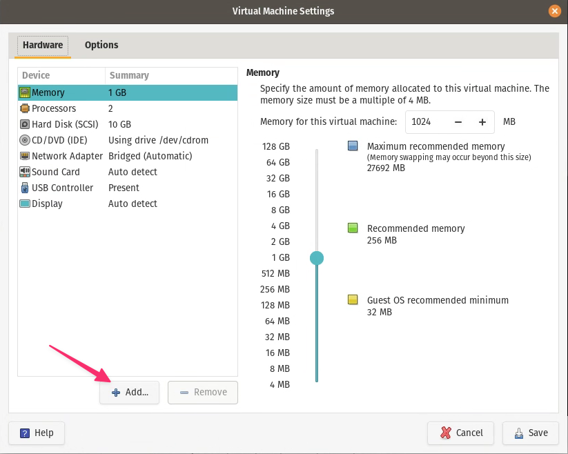  
**Figure 12 : créer la VM sous Workstation 5.**  

Choisissez *Network Adapter* et cliquez *Finish*. Changez le nouvel adaptateur pour *Host-only.*

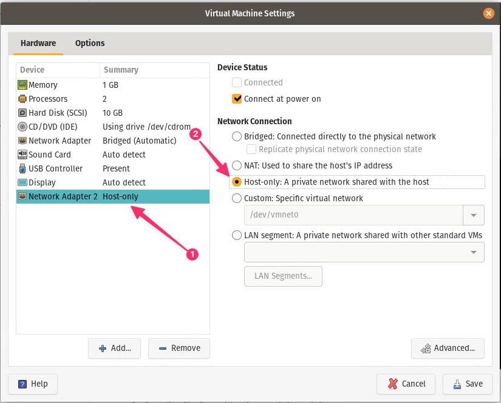  
**Figure 13 : créer la VM sous Workstation 6.**  

Choisissez *CD/DVD*, cliquez sur Use *ISO image* et allez choisir l’image de pfsense.

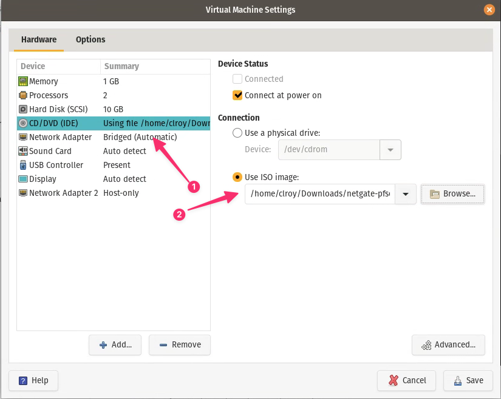  
**Figure 14 : créer la VM sous Workstation 7.**  

Cliquez sur *Save* pour fermer la fenêtre.

### Étape 1b : création de la VM sous vSphere  

Pour la création dans vSphere, vous devez vous créer une VM avec les spécifications suivantes :

* **Dossier dans vSphere** : DFC DS/VM DFC/H25\_4155\_420DN6\_CV\_CR/
* **Nom de la VM** : H25\_4155\_420DN6\_*VosInitiales*\_pfsense\_00\_*#Matricule*  
* **Pour Select a guest OS** : choisir Other et FreeBSD12 (64-bit)  
* **CPU** : 2 CPU
* **Mémoires** : 1 Go
* **Nouveau disque** : 10 Go (attention de choisir Thin Provision ou dynamique)
* **CD/DVD** : SAN-DFC/ISO/netgate-pfsense-2.8-installer-amd64.iso

À la partie *Customize hardware*, vous devez mettre la carte réseau (New Network) dans le réseau **VM DFC2**. Vous devez également ajouter une nouvelle carte réseau (Network Adapter) en cliquant sur **ADD NEW DEVICE**. La nouvelle carte réseau sera dans le réseau **VM DFC3**.

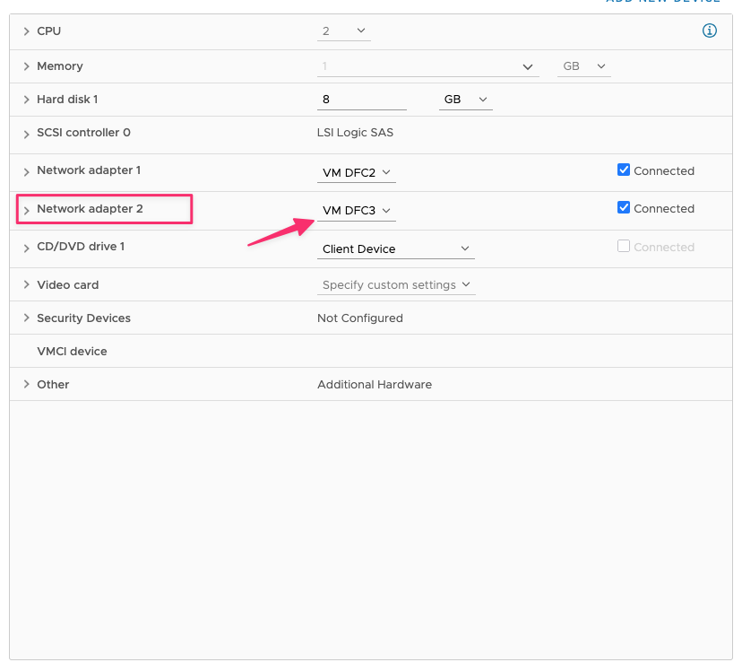  
**Figure 15 : créer la VM sous vSphere.**  

### Étape 2 : configuration du coupe-feu pfSense, inteface cli    

1. Consultez la page <https://docs.netgate.com/pfsense/en/latest/install/install-walkthrough.html> pour l’installation.  

Prenez **vmx0** (**eM0** sous Workstation) pour l'interface WAN.  
Laissez les informations sur l'interface WAN tel quelles (>>>Continue).

Prenez **vmx1** (**eM1** sous Workstation) pour l'interface LAN.  
Changez l'adresse IP (**IP Address**) par celle remise par le professeur. N'oubliez pas de changer la plage DHCP.  

Vous prenez **Install CE** pour l'abonnement.

Prenez les valeurs par défaut pour le système de fichiers.

Prenez la version la plus récente de pfSense. Si vous avez une erreur, pressez **Entrée** pour continuer.  

2. Au redémarrage de la VM.

Il se peut qu'on vous redemande de choisir vos interfaces WAN et LAN.

Vérifiez quelle interface est quoi, si votre interface WAN n’a pas reçu la bonne adresse ip (une de votre routeur maison) ou il n’a pas reçu d’adresse de votre réseau, vous allez inverser vos interfaces. Vérifiez également l'interface LAN et modifiez également le réseau si nécessaire.

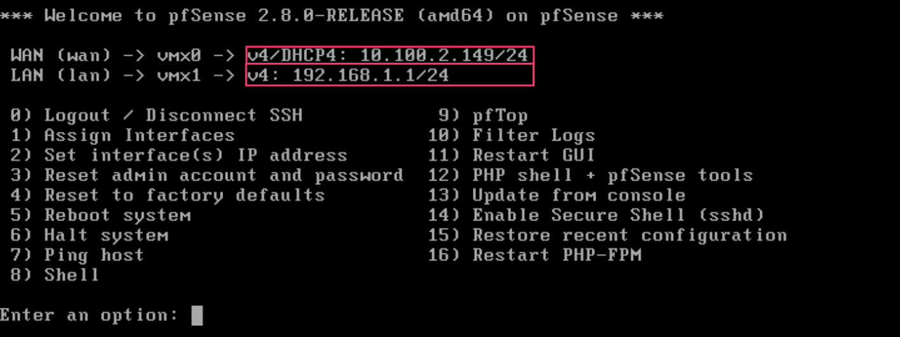  
**Figure 16 : ajuster les interfaces de pfSense.**  

Pour inverser vos interfaces WAN et LAN, une fois connectés, choisir l’option 1 et inverser vos interfaces **vmx0** (**eM0** sous Workstation) et **vmx0** (**eM0** sous Workstation). Ne pas configurer le *LAGGs* ou de *VLAN*.

L’interface WAN doit être en DHCP, mais pas l’interface LAN.

**Attention** : sous vSphere vous devez utiliser les adresses de réseaux que le professeur vous a assignées. **Les adresses affichées sont des exemples.**

Pour configurer le bon réseau LAN, avec Workstation, l’hôte à la première adresse du réseau, donc vous devez changer l’adresse du LAN pour la deuxième. Dans vSphere, vous pouvez garder la première adresse (par exemple 10.10.10.1/24), vous devez également procéder au changement d’adresse pour désactiver le serveur DHCP.

Choisissez 2 (*Set interface IP address*) du menu.

Choisissez l’interface LAN et lui assigner l’adresse **statique** 10.10.10.1/24 (10.10.10.2/24 dans Workstation).  

Ne pas configurer d'adresse IPv6 (DCHP6).  

Dans Workstation, activez le serveur DHCP et donnez la plage d’adresses 10.10.10.100 à 10.10.10.149.

**Attention** : dans vSphere, n’utilisez pas de serveur DHCP.

Ne pas changer le protocole du GUI pour HTTP.

À partir de votre hôte ou d'une VM client, vous pouvez accéder à votre coupe-feu pfsense à https://10.10.10.1 (https://10.10.10.2 avec Workstation, pour vSphere utiliser l'adresse réseau assigner par le professeur). Le nom d’utilisateur/mot de passe sont admin/pfsense. Nous allons continuer la configuration du coupe-feu dans la partie 4.

**Attention** : dans vSphere, vous aurez absolument besoin d’une VM client pour accéder à votre pfSense. Donc, **vous devez faire la partie 3 avant de continuer la configuration**.

## Partie 3 : Création de VMs clients et serveur

Dans notre environnement de laboratoire, nous avons besoin d’un serveur et de clients. Avec Workstation, notre OS hôte Windows va servir comme poste client distant. Avec vSphere, vous aurez besoin d'une VM Windows comme poste distant. Nous avons également besoin d’un serveur interne avec SSH d’actif et d’un client Linux pour le réseau distant.  

**Note** : si votre OS hôte est un Linux, vous aurez également besoin d’une VM Windows.  

### Sous vSphere

* **Dossier dans vSphere** : DFC DS/VM DFC/H25\_4155\_420DN6\_CV\_CR/

### Étape 1 : Serveur interne et clients distants

1. Pour le serveur interne, nous allons installer un Ubuntu serveur (je recommande 24.04) avec seulement SSH.

Voici les spécifications :

* **Nom de la VM, vSphere** : H25\_4155\_420DN6\_*VosInitiales*\_UbSrv\_00\_*#Matricule*  
* **Nom** : ubuntuserver  
* **Processeurs** : 2.  
* **Mémoires** : 1 Go (1024).  
* **Réseau, Workstation** : host-only avec une adresse statique 250 dans votre réseau (exemple, 10.10.10.250) et le serveur DNS 1.1.1.1 (<https://linuxconfig.org/setting-a-static-ip-address-in-ubuntu-24-04-via-the-command-line>). La passerelle par défaut est l'adresse LAN du coupe-feu pfSense.  
* **Réseau, vSphere** : VM DFC3 avec une adresse statique 250 dans votre réseau (exemple, 10.10.10.250) et le serveur DNS 1.1.1.1 (<https://linuxconfig.org/setting-a-static-ip-address-in-ubuntu-24-04-via-the-command-line>). La passerelle par défaut est l'adresse LAN du coupe-feu pfSense.  
* **Disque** : 10 Go (attention de choisir Thin Provision ou dynamique sous vSphere).  
* **CD/DVD, vSphere** : SAN-DFC/ISO/ubuntu-24.04-live-server-amd64.iso  

Pendant l’installation, créer un utilisateur *user01* avec le mot de passe de votre choix. Installer *OpenSSH server*. Ne rien installer d’autre.

Après l’installation, générer une nouvelle clé ssh ed25519 et mettre à jour le serveur.  

2. Pour le client distant Linux, nous allons utiliser un Xubuntu desktop, installation minimale.

Voici les spécifications :

* **Nom de la VM, vSphere** : H25\_4155\_420DN6\_*VosInitiales*\_UbCli\_00\_*#Matricule*  
* **Nom** : ubuntuclient
* **Processeurs** : 2.
* **Mémoires** : 2 Go (2048).
* **Réseau, Workstation** : host-only avec une adresse en DHCP.  
* **Réseau, vSphere** : VM DFC3 avec une adresse statique 100 dans votre réseau (exemple, 10.10.10.100) et le serveur DNS 1.1.1.1. La passerelle par défaut est l'adresse LAN du coupe-feu pfSense.  
* **Disque** : 15 Go (attention de choisir Thin Provision ou dynamique sous vSphere).  
* **CD/DVD, vSphere** : SAN-DFC/ISO/xubuntu-25.04-minimal-amd64.iso  

Créer un utilisateur *user01* avec le mot de passe de votre choix.

Après l’installation, générer une nouvelle clé ssh ed25519, mettre à jour le client et installer les utilitaires de base : open-vm-tools, open-vm-tools-desktop, firefox, wget, curl, git, terminator et neovim.

Vous pouvez également copier votre clé SSH sur le serveur, mais ce n’est pas obligatoire.

Dans vSphere, vous allez devoir déplacer votre VM client entre les réseaux VM DFC2, VM DFC3 et VM DFC4. Naturellement, vous devrez ajuster la configuration réseau (adresse IP, passerelle par défaut) à chaque fois. Dans le réseau MV DFC2, la configuration réseau sera en DHCP. Pour vous aider, vous pouvez vous configurer des profils réseaux.

3. Pour le client distant Windows, nous allons utiliser un Windows 10 (à la maison, vous pouvez utiliser Windows 11) :  

Voici les spécifications :

* **Nom de la VM, vSphere** : H25\_4155\_420DN6\_*VosInitiales*\_Win10\_00\_*#Matricule*  
* **Processeurs** : 2.
* **Mémoires** : 4 Go (4096).
* **Réseau, Workstation** : host-only 2 avec une adresse en DHCP (vous ne receverez pas d'adresse pour l'instant).  
* **Réseau, vSphere** : VM DFC4 avec une adresse statique 100 dans votre réseau 2 (exemple, 192.168.10.101). La passerelle par défaut sera l'adresse LAN du coupe-feu pfSense distant.  
* **Disque** : 48 Go (attention de choisir Thin Provision ou dynamique sous vSphere).  
* **CD/DVD, vSphere** : SAN-DFC/ISO/SW\_DVD9\_Win\_Pro\_10\_21H2.6\_64BIT\_English\_Pro\_Ent\_EDU\_N\_MLF\_X23-13803.iso  

Créer un utilisateur *user01* avec le mot de passe de votre choix.

**Note** : si vous utilisez Windows 11 et vous êtes bloqué à un réseau inexistant ou que vous devez absolument utiliser un compte Microsoft : <https://www.pcworld.com/article/2514125/windows-11-demands-you-use-a-microsoft-account-heres-how-to-bypass-it.html>. Il y a une erreur dans la commande, on devrait lire : `net user “thomas” /add`.  

## Partie 4 : configuration du coupe-feu pfSense, interface Web  

Utilisez le client Linux pour vous connecter à l'interface Web du coupe-feu pfSense, vous devez utiliser l'adresse LAN de votre pfSense : https://10.10.10.1 (https://10.10.10.2 avec Workstation, pour vSphere utiliser l'adresse réseau assigner par le professeur). Le nom d’utilisateur/mot de passe sont admin/pfsense.
 
1. À votre première connexion, un « Wizard » vous sera présenté (<https://docs.netgate.com/pfsense/en/latest/config/index.html>).

À l’aide du Wizard, compléter :

* **Hostname** : pfSense  
* **Domain** : *votrenom*.home.arpa  
* **Serveurs DNS primaire et secondaire** : je recommande 1.1.1.1 et 1.0.0.1.  
* **Décocher Override DNS**.  
* **Le fuseau horaire** : Timezone America/Montreal.  
* **À la page Configure WAN Interface** : décocher *Block RFC1918 Private Networks*.  
* **Configurer le mot de passe Admin**.

Vous pouvez laisser le reste tel quel, mais je vous recommande quand même de consulter l’information présentée.

Une fois votre serveur relancé, à la page *Wizard completed*, cliquez sur *check for updates*.

Si vous n’avez pas de mise à jour, cliquez sur le logo de pfsense en haut à gauche pour aller au *Dashboard*.

2. Vous pouvez installer les VM Tools. Dans le menu du haut, choisir *System/Package Manager*.

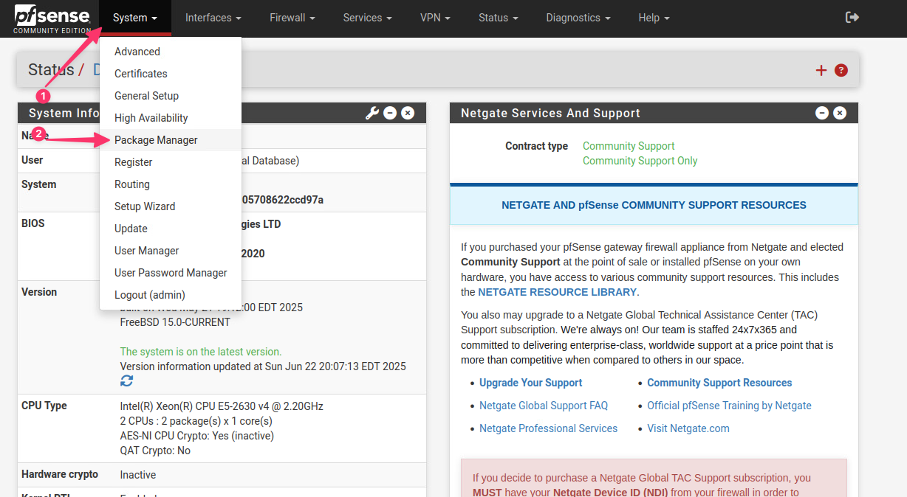  
**Figure 17 : pfSense Package Manager.**  

Cliquer sur *Available Packages* et faire une recherche vmware. Cliquez sur *Install* pour les installer.

## Partie 5 : réseau distant  

Pour ajouter le réseau distant, nous allons cloner le coupe-feu déjà installé et déplacé la VM client Linux dans le réseau distant.  

### Étape 2a : 2e coupe-feu Workstation

1. Pour votre deuxième coupe-feu, vous allez cloner votre VM pfsense.  

Avant le clonage, fermez votre VM.  

Dans le menu *VM->Manage* choisir *Clone*.

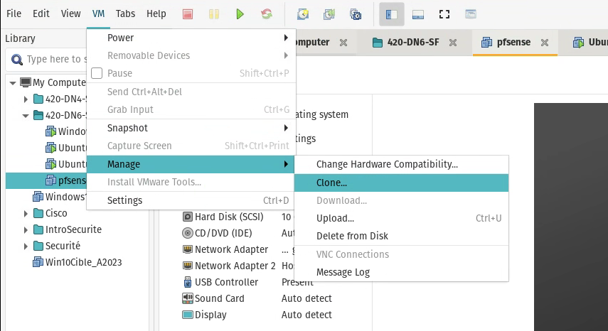  
**Figure 18 : Workstation clone.**  

Faire *Next* à la première fenêtre.  

Faire *Next* à la prochaine fenêtre pour accepter d’utiliser l’état actuel.

Dans la prochaine fenêtre, assurez-vous que *Create a linked clone* est bien coché.

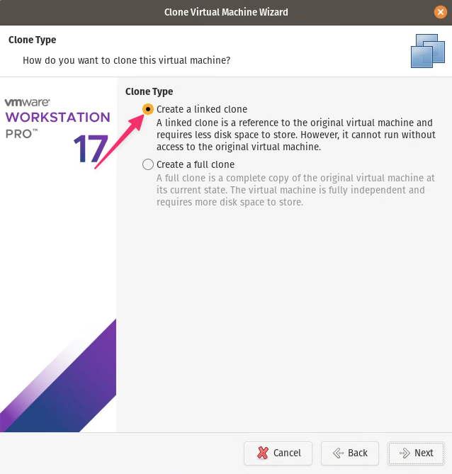  
**Figure 19 : Workstation linked clone.**  

Un *linked clone* va prendre moins d’espace sur votre disque.

Dans la prochaine fenêtre, changer le nom de la VM pour **pfsenseRemote**.

À la dernière fenêtre, cliquez *Finish*.

2. Une fois la VM créée, vous devez changer la deuxième carte réseau pour le deuxième réseau Host-only.

Lancez votre coupe-feu.

Vérifier que vous avez bien reçu une adresse IPv4 de votre réseau maison sur l’interface WAN.

Vous devez changer l’adresse de votre interface LAN à 192.168.10.2/24 avec un DHCP pour les adresses 192.168.10.100 à 192.168.10.149.

Accéder à votre coupe-feu pfsens à https://192.168.10.2. Le nom d’utilisateur admin et le mot de passe que vous avez configuré.

Une fois connectée, changez le nom de l’hôte pour pfSenseRemote : *System/General Setup*.

3. Placez votre client Linux dans le réseau host-only 2.

Vérifiez que vous avez reçu une adresse IPv4 et la connectivité.  

### Étape 2b : 2e coupe-feu vSphere

1. Pour votre deuxième coupe-feu, vous allez cloner votre VM pfsense.  

Avant le clonage, fermez votre VM.  

Avec le bouton droit de la souris sur votre VM pfSense, choisir *Clone->Clone to Virtual Machine*.  

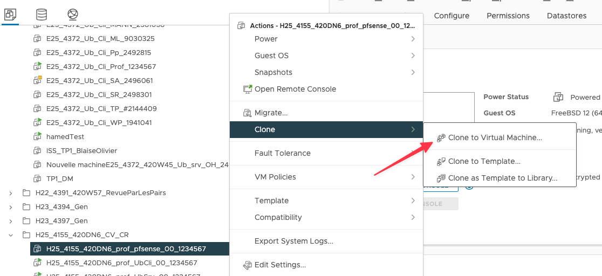  
**Figure 20 : vSphere clone VM.**  

Voici les informations de clonage :  
* **Dossier dans vSphere** : DFC DS/VM DFC/H25\_4155\_420DN6\_CV\_CR/  
* **Nom de la VM** : H25\_4155\_420DN6\_*VosInitiales*\_pfsense\_01\_*#Matricule*  

Pour le reste, continuez comme d’habitude.

2. Une fois la VM créée, vous devez changer la deuxième carte réseau pour le réseau **VM DFC4**.

Lancez votre coupe-feu.

Vérifier que vous avez bien reçu une adresse IPv4 du réseau VM DFC2 (10.100.2.X) sur l’interface WAN.

Vous devez changer l’adresse de votre interface LAN au deuxième réseau indiqué par le professeur et ne pas utiliser de serveur DHCP.

Vous devrez déplacer votre VM Ubuntu client dans le réseau VM DFC4 pour configurer le pfSenseRemote. N’oubliez pas de changer les configurations réseau du client : l’adresse IP doit être dans le réseau LAN du deuxième coupe-feu et la passerelle à l'adresse IP LAN du deuxième pfSense.  

Accéder à votre deuxième coupe-feu pfSense à https://*adresseLAN*. Le nom d’utilisateur admin et le mot de passe que vous avez configuré.  

Une fois connectée, changez le nom de l’hôte pour pfSenseRemote : *System/General Setup*.  

Vérifiez la connectivité.  

Dans vSphere, vous ne pourrez pas faire de snapshot de vos VMs, donc vous devrez toujours effacer les configurations de l’exercice précédent.  

## Compétences développées

**FW20 – Installer un réseau privé virtuel de façon sécuritaire.**  

	1 – Expliquer ce qu’est un Réseau privé virtuel (VPN – Virtual Private Network).  
	2 – Installer un réseau privé virtuel de façon sécuritaire.  

**Note** : les compétences sont développées en partie.

## Références  

<https://docs.netgate.com/pfsense/en/latest/>  
<https://kifarunix.com/configure-ubuntu-20-04-as-linux-router/>  
<https://linuxconfig.org/how-to-make-iptables-rules-persistent-after-reboot-on-linux>  
<https://linuxconfig.org/setting-a-static-ip-address-in-ubuntu-24-04-via-the-command-line>  